# Agent optimizer methodology

整理日期：2026-10-03。状态：**供评审的设计草案**。本文是离线研究、在线高层决策与局部纠错的总体方法论入口；具体巡天策略作为可替换的研究对象。当前环境、规则和实验数字分别由既有文档及原始记录维护，本文引用这些来源。

后续首版结构与开发节点已整理为 [方案大纲](agent-optimizer-outline.md)，用户决定和剩余未知见 [核对记录](agent-optimizer-decisions.md)。评审具体落地顺序时先读这两份文件；本文保留研究原理与方法边界。

## 1. 目标、范围与结论状态

用户明确的研究方向：将固定程序中的 LLM 环节替换与复核，和 LLM 驱动的离线开发、高层实时决策及纠错结合起来。当前重点是方法论及其落地方式，不纠结具体策略细节；整理文档是为了让后续 Agent 能独立评审。

预期形成一个能提出问题、执行实验、积累能力、在线应用并根据反馈修正的优化系统。它需要同时回答两个问题：研究 Agent 是否更有效地找到改进，以及交付的改进是否让在线系统在未见场景中表现更好。两者分别验证。

| 状态 | 本文如何使用 |
| --- | --- |
| 用户明确方向 | 上述协作方式、方法论范围和后续评审用途 |
| 已有证据 | 本地程序实验、当前环境迁移验证；沿原始版本和样本范围解释 |
| 设计建议 | 本文提出的分工、接口、研究循环、成果管理和验证顺序；尚未全部实现 |
| 待验证假设 | LLM 能改善实验选择、状态理解、工具编排、阶段规划或纠错；不能据讨论认定有收益 |
| 待决定事项 | 首个研究问题、数据分组、预算、晋级标准及模型选择；见第 12 节 |

本轮交付是文档整理。没有新增策略实验、真实模型调用、线上提交或独立评审。本文提出的后续步骤不构成真实执行授权。

## 2. 已有材料与证据边界

| 需要了解的背景 | 权威来源 | 与本设计的关系 |
| --- | --- | --- |
| 当前入口、快照、离线模式和隔离能力 | [当前环境](current-environment.md)、[机械环境定义](../experiments/current/environment.json) | 落地沿用此入口，不重新搭建平行运行环境 |
| 已完成验证 | [迁移验证原件](../experiments/current/validation.json) | 证明既有链路的运行情况，不证明新增 Agent 的能力 |
| 比赛协议、计分与现实观测差异 | [规则台账](v4-rules-and-protocol.md)、[当前固定快照指南](../research/2026-10-03/latest-149c659/docs/v4-participant-guide-zh.md) | 规则台账标明历史核对日期；当前版本关系以环境页为准 |
| 两批策略实验及局限 | [实验历史](experiment-history.md)、[完整实验报告](v4-strategy-study-report.md) | 提供研究问题与回归证据，不重抄分数或重新排名 |
| 早期在线 LLM 接入设计 | [程序与 LLM 协作](v4-llm-collaboration.md) | 保留具体接入、建议格式、校验和回退示例；总体方法论由本文维护 |
| 正式四卡现状 | [四卡预检](../experiments/v4/manual_card_evaluation/preflight_results.json)、[外部状态](../experiments/v4/external_evaluation/results.json) | 本地公开卡和历史合成卡不能替代正式四卡成绩 |

对设计有直接影响的事实：

- 已有实验显示局部收益、组合收益和跨样本表现不能直接互推；这些结果支持建立机制检验与冻结评价，不支持某个 LLM 架构已经有效。
- 当前程序入口已完成离线链路验证；已有验证中的模型调用为零。旧示例、当前示例和提出的统一协作层是不同对象。
- 已揭示历史保留集只用于回归，公开 L1–L4 是开发和回归材料。新增泛化结论需要先登记数据分组与冻结条件。
- Agent 通过公开协议逐步获得信息。真实未来条件不可直接读取；曝光反馈也不等于完整环境状态。无法区分的解释需要保留为未知。
- 环境逐动作反馈；模拟时间和真实计算时间分别计量。线上没有已确认可供 Agent 使用的任意分支、回滚接口；用内部模型搜索时，结果属于预测。
- 规则台账所核对版本要求至少两个环节使用大模型驱动的 Agent 技术。离线生成程序是否计入尚未确认；方法有效性与赛事资格分别核实，不能用两个接口或两种职责直接证明合规。
- 当前目录与凭据处理不等于 OS 沙箱。按项目约束，研究 Agent 不读取完整卡文件；truth 仅由官方环境运行和评分使用。数据与授权边界以 [项目规则](../AGENTS.md) 和环境页为准。

“离线研究”表示开发与实验阶段，可能包含研究模型；当前运行入口的“离线模式”则明确关闭参赛 Agent 的真实模型调用。准备真实模型实验时，需要另行落实受控试用契约，不能通过直接切换开关推导授权。

## 3. 分工：谁负责提出、计算、检查与执行

建议设置四种职责。职责可以由同一模型在不同上下文承担，不要求四个模型或四个进程。

| 职责 | 主要工作 | 产出与权限边界 |
| --- | --- | --- |
| 离线研究 Agent | 提出研究问题与竞争解释，改进代码、状态表示、工具和工作流，选择实验并解释证据 | 交付候选成果及证据；不能修改官方评分器、读取卡中未来答案或自行宣布泛化成立 |
| 在线规划 Agent | 判断当前瓶颈，选择补充计算，组合已验证能力，形成有条件和期限的阶段计划 | 输出可检查的计划与工具请求；不直接覆盖公开事实或硬约束 |
| 局部评价与纠错 | 检查某项估计或选择，识别矛盾，请求有区分力的证据，提出修正 | 复核必须使用新证据、不同计算或明确检查；重复询问模型意见不能增加独立证据 |
| 程序底座 | 保存状态，完成精确计算与搜索，检查约束、预算和时效，执行动作并记录反馈 | 提供权威记录、可执行工具与回退；合法性检查不保证真实收益或判断正确 |

用户负责目标及取舍、场景代表性、不可接受的退化与真实执行边界。具体实现、实验执行和候选探索可由 Agent 在约定范围内持续完成。

图按一轮离线研究和一次在线决策展示关系；底部反馈用于更新下一轮研究问题或在线状态，具体循环见第 4 节。“冻结评价”是一套独立执行的评价程序与数据权限，不必由另一个 LLM 担任。正常在线运行使用固定版本的已验证成果；新成果在明确的更新边界进入下一轮运行，避免实验中途悄然改变被比较对象。

LLM 的探索范围可以包括新的问题分解、状态摘要、搜索算子和工具组合。精确枚举与数值求解继续由工具完成。是否扩大模型控制范围，由实验证据决定。

## 4. 三个闭环如何配合

### 4.1 离线研究循环

观察现象，提出多种解释，选择能区分解释的实验，实现候选，检查实现，筛选并完整比较，寻找反例，最后保留、收窄或放弃结论。

研究记录必须把“这个版本表现更好”和“它因某个机制而更好”分开。前者需要可比较的结果，后者往往还需要消融或干预。允许一次提出结构性变化，随后用必要的对照分析贡献；不把只改一个参数作为所有研究的规则。

开发预算需要兼顾已有方向的改进和不同结构的探索。短试验可淘汰明显无效候选；具有长期影响的方案仍需完整任务评价，不能仅凭短期代理分数提前否定或晋级。

### 4.2 在线规划与执行循环

程序更新公开事实和估计，检查现有计划是否仍适用。出现重要变化或尚未解决的决策缺口时，规划 Agent 可以请求工具比较、选择方法或组合操作。程序验证后只提交当前允许的一次动作，随后依据新反馈继续执行或重新规划。

候选和工具接口需要保留不同目标与假设的选择。如果程序只生成同一种方案的近似变体，模型无法从中找出被排除的方向。若在给定信息下后果已可精确比较，则可由程序直接选择。

### 4.3 局部检查与修正循环

检查对象应具体，例如一个估计是否依赖过期证据、两个约束是否冲突、某项计划的前提是否还成立。发现问题后，可以重算、查询补充信息、执行有代价的探测，或回退并保留不确定性。

模型给出的解释和自评置信度都属于待检查输出。主动探测的价值需要由后续决策收益支持，并计入消耗的时间和机会。在线反馈进入离线问题清单后，也仍是研究线索，不能自动变成可靠的因果标签。

## 5. 离线阶段具体做什么

此处的“训练”优先指系统层面的学习：改进程序能力、在线工作流和可检索经验。微调模型权重是后续可选择的实验。

| 工作 | 研究 Agent 的主要任务 | 最小可检查成果 |
| --- | --- | --- |
| 建立评价条件 | 帮助识别目标、场景差异、约束和现有证据缺口 | 登记评价对象、样本用途、预算和冻结条件；代表性由任务需求与外部证据检查 |
| 建立研究问题清单 | 从公开轨迹和指标中找现象，提出竞争解释，设计反证 | 问题、证据位置、假设、预期现象、证伪条件和下一实验 |
| 搜索方法与工具 | 修改局部方法，或改变问题分解、状态表示和工具编排 | 可运行候选、变更范围、计算成本、实现检查结果 |
| 执行对照与反例检验 | 决定继续、扩大、修正或放弃方向 | 同环境比较、失败分支、机制解释的支持度和适用范围 |
| 构造在线决策练习 | 训练信息选择、工具调用、计划调整和错误恢复的工作方式 | 保留当时可见输入的案例、工具反馈、决策和后续评价 |
| 整理可复用成果 | 将有效方法交付在线系统，将否定结论反馈研究过程 | 代码或工作流、适用条件、失效信号、回退和证据链接 |

### 5.1 问题清单应包含什么

研究问题可以是：效果不佳来自信息不足还是信息使用不当；工具改进与 LLM 编排各有多少贡献；纠错失败发生在发现偏差还是选择修正动作。具体策略名称不是问题结构的一部分。

先保留几种可能解释，再选择最有区分力的下一实验。记录预期结果有助于避免看到分数后才构造解释。保留负结果和失败条件，供后续检索去重；不只保存当前最高分程序。

### 5.2 在线决策练习怎样构造

每个案例保存决策时实际可见的信息、可用工具、工具返回、采用的决策、后续结果和适用条件。案例覆盖正常执行、信息不足、相互矛盾的证据、新条件、计划失效、工具错误、超时和恢复。

案例输入只能来自公开协议前缀。后续结果可以作为离线评价材料，不能回填为当时已知事实。没有受支持的归因证据时，不能把失败任务中的每步都标错，也不能把高分轨迹的每步都当作最优示范。

静态回放能检查理解、工具选择、格式和时效等性质。改变动作后的任务收益，需要重新运行交互环境；不得拼接不同既有轨迹的好片段来声称新策略有效。若未来增加离线分支回放，先验证该能力及随机过程可比性，再使用它作反事实证据。

### 5.3 什么时候考虑模型权重训练

建议等接口与工作流稳定、积累足够多样且可核验的样本、某类能力缺陷反复出现后，再比较提示改进、检索、规则、小型专用模型与微调。数据量阈值和训练方式尚未决定。

若主要问题是缺少信息或评价标签不可信，微调不能补足依据。真实训练或推理所需数据、模型服务和费用另行登记。当前优先级是设计建议，尚无本项目比较证明哪种训练方式最优。

## 6. 研究型 Agent 的能力边界

下表是安排工作的工程判断，不是本项目已经测得的能力排名。能力依赖模型、工具、任务反馈及预算，不能把既有论文中的模型成绩视为当前模型上限。

| 工作 | 预期适配程度 | 主要难点与补足方式 |
| --- | --- | --- |
| 把明确想法实现为代码与实验 | 较适合大量承担 | 用接口检查与真实执行反馈确认实现符合设想 |
| 提出多种解释、方法变体与反例 | 有较大价值 | 新颖和有用分别判断；解释必须有证伪条件 |
| 整理证据、选择下一实验、复用成果 | 值得优先验证 | 事实登记交给程序；实验选择质量通过后续证据衡量 |
| 大量数值枚举与重复运行 | 适合调用工具完成 | 不用逐个 LLM 回合替代批量计算 |
| 从结果中发现规律 | 适合形成研究线索 | 相关性、选择偏差和偶然高分需要后续对照 |
| 将长期结果归因到某个决策 | 难以直接可靠完成 | 延迟反馈和环节耦合需要消融、干预及完整任务评价 |
| 判断场景是否代表未来 | 难以自行保证 | 由任务边界、场景设计和未见条件补足；模型不能证明未覆盖的世界 |
| 长期自主分配研究预算 | 值得尝试，需分阶段验证 | 防止重复局部改动、忽视负结果、追逐噪声；记录停止与转向依据 |

长期研究中的关键未知，包括是否能突破原有搜索框架、稳定识别错误解释，以及在预算增加后持续获得收益。现有外部研究支持开展这些实验，但本项目尚未完成对应验证。

## 7. 离线与在线之间的最小接口

以下字段是供评审的逻辑契约，不代表已经存在的类、文件格式或冻结 API。落地时优先扩展已有权威记录，避免重复保存相同事实。

| 对象 | 最小内容 | 谁维护、谁使用 |
| --- | --- | --- |
| 状态与证据 | 请求序号与时间、公开观测及来源、估计及假设、未知项、有效期或失效条件 | 程序维护；所有模型角色读取同一依据 |
| 研究问题 | 现象、证据引用、竞争假设、预期现象、证伪条件、下一实验、停止条件 | 研究 Agent 提出；实验结果更新证据状态 |
| 实验记录 | 候选版本、环境与样本分组、预算、执行状态、原始指标引用、失败原因 | 程序登记；Agent 分析；完整结果与异常退出分开 |
| 能力成果 | 实现或工作流、输入输出、前置条件、适用范围、成本、失效信号、回退、证据 | 离线产生并验证；在线调用固定版本 |
| 在线计划 | 所依赖状态版本、目标、方法或工具选择、证据引用、剩余预算、有效期、重新评估条件 | 规划 Agent 提议；程序验证并逐动作执行 |
| 经验条目 | 可复用判断、支持与反对证据、适用条件、版本、尚未解释的例外 | 从实验记录提炼，保留原始引用；不能直接替代当前事实 |

观察事实、估计和假设需要明确分开。状态更正应使依赖它的估计与计划重新接受检查。两个策略共享状态时，不能假定各自私有历史和估计含义天然兼容。

经验应能改变后续行动。例如记录“出现哪些证据时增加哪项检查，以及检查结果如何影响选择”；“以后更谨慎”不能直接执行。重复且稳定的发现可以固化为程序，复杂或未覆盖的取舍继续交给模型。

## 8. 成果如何进入在线系统

提出一个候选后，先确认实现与约束，再通过开发对照和反例检验。保留候选需要冻结相关代码、提示、配置、数据用途、选择规则和预算，随后进行预先登记的评价。

评价支持的结论只覆盖实际检查过的范围。没有收益的结果也可以成为研究经验，但不能仅凭解释合理就进入在线能力库。进入能力库后仍保留前置条件、失效信号和版本；出现新反例时收窄适用范围、停用或重新研究。

初版建议把新代码生成放在离线阶段，在线选择与组合已验证能力。后续可逐步扩大到在线工具编排和局部方案生成，再单独研究实时新代码；每一步都需测量可靠性、预算与恢复能力。尚无依据要求一开始就实现在线自修改。

## 9. 怎样评价这套方法论

### 9.1 研究过程的评价

在相同工具、可见信息和预先登记的开发预算下，可比较固定实验计划、研究 Agent 自适应选实验，以及移除某项研究机制后的版本。若能比较人工研究，应同时记录人的时间，避免把投入差异归因于 Agent。

记录模型调用和费用、模拟器运行数与算力、总耗时、人工介入；观察获得一个可复验结论或未见场景改进的成本。负结果可以有研究价值，但假设数量、报告长度和实验次数本身不等于研究进展。

### 9.2 在线系统的评价

固定共同程序能力与公开信息后，分别比较程序增强、只加入局部 LLM 评价或纠错、只加入高层规划、两者结合。具体五组接入示例见 [早期协作设计](v4-llm-collaboration.md)；其中旧程序底座不自动成为新版已选基线。

为区分额外计算与模型判断的贡献，至少记录同等运行预算下的比较，并展示收益随预算的变化。离线开发成本和在线每次运行成本分开，不把离线反复搜索隐藏在“同等在线预算”的结论里。

除最终目标，还要关注完整执行率、关键约束、错误与恢复、模型尾部延迟、调用预算和回退表现。机制指标帮助诊断，不能替代最终任务效果。

### 9.3 数据与统计判断

项目当前采用的模拟开发、官方练习卡复测与线上测试三阶段流程，以及模拟分组和数据边界，统一见 [数据集契约](test-datasets.md)。

开发、选择和最终评价的用途需先登记；验证集若持续反馈并用于改进，也会成为开发信息。候选冻结后再评价新样本，记录试过的候选及结果使用历史，避免只报告最好的一次。

场景划分应覆盖任务结构与环境条件的变化，而不只有新种子。配对比较尽可能使用相同的外部条件；若策略改变随机数消耗，需确认相同种子仍具有何种可比性。同一任务的多次决策和确定性重复运行不能当作独立泛化样本。LLM 重复运行可估计模型波动，但不能替代增加独立场景。

小样本报告实际差异与范围，保留无法判断的结论。反复使用保留集会产生自适应过拟合；相关方法学依据见第 13 节。

## 10. 怎样落到当前项目

优先复用当前入口和模块；下表是接入位置，不是要求本轮修改这些文件。

| 已有基础 | 可承接的工作 | 尚需设计或验证的部分 |
| --- | --- | --- |
| [运行入口](../scripts/run_current.py)与当前运行记录 | 可复现实验、环境与候选追踪、指标读取 | 研究任务登记、数据分组、预算与候选选择记录 |
| [状态模块](../experiments/current/agent/agent_core/state.py) | 公开消息与结果更新、已有估计 | 统一证据引用、事实与估计标识、依赖失效处理 |
| [规划器](../experiments/current/agent/agent_core/planner.py)和数值模块 | 候选计算、现有模型咨询与程序回退 | 高层计划、工具请求、不同动机候选和局部纠错接口 |
| [动作校验](../experiments/current/agent/agent_core/validation.py) | 当前动作约束检查 | 新增计划和建议的时效、引用、预算检查；收益仍需实验 |
| [模型客户端](../experiments/current/agent/agent_core/llm_client.py) | 既有调用与离线开关 | 模拟返回、超时及异常验证；真实调用另按授权范围执行 |
| [可选轨迹日志](../experiments/current/agent/agent_core/memory.py) | 记录规划事件 | 它目前不是可检索研究经验库；经验需绑定原始证据与适用范围 |

建议的首个可学习闭环：选一个明确的能力缺口，用公开轨迹组织证据，提出可检验假设，实现最小候选，跑完对照与失败路径，再保存结果和适用范围。首个问题与模型角色由评审后决定，不在此指定具体策略。

实现推进可以分为三个证据阶段：

1. 用现有程序和模拟模型返回接通证据、建议、检查、执行、回退与记录。这一阶段验证接口和恢复，不声称真实模型有收益。
2. 在完成真实调用所需授权后，验证一个有明确作用的模型环节，并与同工具的程序对照比较。具体样本和预算先登记。
3. 只有单环节的证据支持继续时，再验证高层规划与局部纠错组合、成果检索，以及跨场景表现；必要时否定或简化原设计。

第一轮研究可以得到可靠的负结论。在线采用则需要另行满足已登记的收益、可靠性和成本条件。

## 11. 后续 Agent 的评审入口

建议先读本文第 1–3、9–12 节，再按待核查问题进入环境、源码和原始记录。完整聊天历史不作为评审前提；现有文档和可追溯证据应足以形成独立判断。

评审目标是找出会改变方法论或首个验证步骤的问题，重点检查：

1. 研究目标、在线任务目标和模型训练目标是否被混用，成功标准是否可测。
2. LLM 是否得到足够的决策空间，同时具备可信计算、校验和恢复工具。
3. 有没有把工具或额外算力的贡献归因于 LLM，或选择了明显偏弱的程序对照。
4. 事实、估计、假设、未来信息以及训练和评价数据之间的边界是否成立。
5. 研究循环是否能推翻解释、保留负结果、发现新方向，而不只追逐已知样本的最高分。
6. 局部检查、高层规划与离线研究的职责和成果接口是否清楚，是否有重复权威来源。
7. 研究 Agent 的能力预期是否超过证据，长程归因与场景代表性由谁补足。
8. 当前项目是否存在更小且同样能回答关键未知的实现方式。

每项实质发现给出：问题与证据位置、成立条件、对下一证据阶段的影响、最小修正或区分实验。区分事实错误、未验证假设和实现偏好；是否阻塞应结合可达性、后果、可逆性和机械约束，不能只给严重度标签。

后续真正采用生成者与评审者分离时，遵守用户指定的独立评审契约。本文尚未经过独立评审，不预置评审结论。

## 12. 待决定与优先验证问题

初稿提出的目标、数据、能力缺口、预算与验证问题，现统一在 [核对记录](agent-optimizer-decisions.md)维护状态、依据和处理节点。首版组成与推进顺序见 [方案大纲](agent-optimizer-outline.md)。本文不保留第二份随实施变化的决定表。

方法论本身仍需通过第 9 节的对照区分工具、模型与额外计算的贡献；在线自主权和模型权重训练分别按第 8 节及第 5.3 节所述证据条件决定。剩余未知不妨碍当前大纲评审，也不应被默认值悄然替代。若后续出现改变用户目标或成功标准的实质歧义，按用户指定的阶段路由处理。

## 13. 外部研究依据及可借鉴范围

以下是本次讨论已查阅的研究线索。它们支持方法选择或实验设计，不是本项目 LLM 效果的证据；论文中的当时模型结果也不是当前模型能力上限。

| 来源 | 可借鉴部分 | 外推边界 |
| --- | --- | --- |
| [AlphaEvolve](https://deepmind.google/blog/alphaevolve-a-gemini-powered-coding-agent-for-designing-advanced-algorithms/) | 程序生成、自动验证、评价反馈与演化搜索 | 依赖可执行评价；不能直接推导在线部分可观测任务中的收益 |
| [ReEvo](https://arxiv.org/abs/2402.01145) | 把 LLM 用于启发式生成与基于反馈的演化 | 组合优化结果需要在本项目环境重新验证 |
| [Voyager](https://arxiv.org/abs/2305.16291) | 可执行能力库与反馈驱动的技能积累 | 其环境和任务与本项目不同，借鉴成果组织方式 |
| [CRITIC](https://arxiv.org/abs/2305.11738) | 使用外部工具反馈检查并修正输出 | 工具反馈也有信息与模型误差边界；不能把自我评价当作外部证据 |
| [LATS](https://arxiv.org/abs/2310.04406) | 将推理、行动与搜索结合 | 本项目线上没有已确认的任意回滚能力，内部搜索仅能基于可用模型 |
| [MLE-bench](https://openai.com/index/mle-bench/)与[RE-Bench](https://metr.org/blog/2024-11-22-evaluating-r-d-capabilities-of-llms/) | 在明确任务、工具和资源条件下评价研究工程能力 | 不能用历史模型的总体成绩替代当前研究 Agent 的实测 |
| [自适应数据分析与保留集复用](https://arxiv.org/abs/1506.02629) | 根据前次反馈反复选择假设也会导致过拟合 | 这里采用数据用途登记与冻结评价建议，未实现论文中的专门统计机制 |

## 14. 文档维护

本文维护总体方法论、逻辑接口、能力边界与评审问题；[方案大纲](agent-optimizer-outline.md)维护首版组件与开发节点；[核对记录](agent-optimizer-decisions.md)维护用户决定和重要未知；[在线协作示例](v4-llm-collaboration.md)维护具体接入说明；[当前环境](current-environment.md)维护运行契约；[实验历史](experiment-history.md)与原始登记维护证据；[交接页](session-handoff.md)维护当前状态与下一步。

设计变更先更新对应权威来源，再修改入口链接。若后续实验否定某项建议，应在本文标注修订并引用新证据。不得把文档检查、模拟模型测试或一次开发胜出写成真实 LLM 收益已经验证。

两幅图只编辑 `docs/diagrams/agent-optimizer-loops.mmd` 与 `docs/diagrams/agent-capability-lifecycle.mmd`，使用 document-diagrams 渲染同名 SVG 并检查 freshness。本文暂以 Markdown 为评审入口；已有在线协作 HTML 继续从其原 Markdown 与已有构建脚本生成。
