# Agent optimizer outline

日期：2026-10-03。状态：**总体大纲已获用户确认，数据构建节点已开始实施**。目标是围绕当前比赛建立可持续改进的系统，以未见练习场景中的效果、可靠性和成本验收；离线研究首版由 Codex 驱动本地工具。

用户决定、查明事实、建议与剩余未知的权威清单见 [核对记录](agent-optimizer-decisions.md)。研究原理和完整能力边界见 [方法论](agent-optimizer-methodology.md)。本文只规定主要组成、开发节点、解耦边界和验证方向，具体接口、参数与算法在实施时细化。

## 1. 起点与首版形态

后续以 [当前环境](current-environment.md)和最新公开 L1–L4 为起点，对应用户指定的 [「更新实验环境与文档」session](codex://threads/01a0fd9d-6df8-73e1-9a9c-80a9881a9b68)。版本和运行入口以 [environment.json](../experiments/current/environment.json) 为权威，不在本文重复一份环境配置。

首版采用本地模块化程序：Codex 承担研究判断，固定程序管理数据、运行、计算、评价和成果记录；可交付的在线 Agent 独立运行。当前 Python 工具和运行入口继续复用。暂不因未来可能替换模型或语言而先建设通用平台、分布式服务或常驻多 Agent 调度器。

**先扩充并划分数据，再进行候选方法搜索。** 新数据由固定程序按照当前机制生成和校验，不让 LLM 编造观测真值。公开 L 卡与已揭示历史卡继续作为开发、校准和回归材料，不能恢复成盲测。

## 2. 整体架构

图中是职责和产物流向，不要求每个框独立部署。Codex 通过工具读取实验结果，继续下一轮研究；官方环境运行与评分时使用完整卡，模型侧只接收允许的公开信息和研究结果。在线项目内部的决策流程沿用 [方法论](agent-optimizer-methodology.md)第 3–4 节与 [接入示例](v4-llm-collaboration.md)。

| 部分 | 首版职责 | 边界 |
| --- | --- | --- |
| Codex 研究工作区 | 提问题、写候选、调用实验工具、分析证据、决定继续或放弃 | 不改官方评分器，不读卡中 truth，不自行改变冻结评价数据用途 |
| 数据集程序 | 固定生成器、生成新卡、校验、分组和记录来源 | 完整卡与种子由数据和评价程序保管；模型接口只暴露允许的摘要与引用 |
| 实验执行与评价程序 | 接收候选和数据集引用，调用当前运行器，管理预算、异常和结果 | 是唯一实验执行入口；候选代码不能修改评分和验收规则 |
| 结果与成果记录 | 保存原始结果、研究问题、候选版本、对照结论和适用范围 | 原始结果是事实来源，分析报告只引用；候选成功与机制解释分开 |
| 候选导出程序 | 从冻结版本导出在线项目所需代码、配置和能力 | 不携带训练卡、truth、开发凭据或整套研究历史 |
| 在线 Agent | 从公开状态选择和组合能力，按需使用 LLM 规划或纠错，经校验提交动作 | 不依赖运行中的 Codex，也不在线修改评分或读取离线未来答案 |

最重要的三条边界是研究工作区与可信实验程序之间、模型可见资料与完整卡之间、开发环境与可交付在线项目之间。当前目录隔离不提供 OS 级保证；实现时需要按数据用途落实访问限制，不能仅靠文件夹名称宣称盲测。

## 3. 研究型 Agent 应包含什么

首版可以是一份研究任务约定、几类固定工具和可恢复记录，不必另写一个大模型循环服务。六项能力先由同一个 Codex 会话承担：

1. **问题与假设管理**：把现象转为可检验问题，保留竞争解释、证伪条件和停止条件。
2. **方法与工具开发**：改进策略、状态摘要、候选生成、工具编排或提示；可改范围由本轮任务规定。
3. **实验选择与预算分配**：选择下一实验，筛除明显无效候选，对长期影响做完整任务验证。
4. **证据分析**：读取程序产生的结果，区分实现错误、性能差异、机制推断和证据不足。
5. **成果与负结果积累**：记录方法、适用条件、失败案例及原始证据，供后续检索和去重。
6. **恢复与交接**：依据任务、候选和运行记录接续，识别已完成、失败或仍在运行的实验，避免重复启动。

建议在研究目标、可改范围与预算明确后允许自主完成日常实验循环；改变目标、数据分组用途、真实调用范围或交付版本时进入相应决定节点。人不必逐次批准普通局部修改，但重要结论不能由 Agent 自评替代证据。

Agent 的强项预期是实现可检验想法、产生不同解释和利用反馈迭代。长期因果归因、未知场景代表性与泛化保证需要额外对照和外部依据，具体能力预期见 [方法论第 6 节](agent-optimizer-methodology.md)。

## 4. 数据集先怎么做

### 4.1 生成路径

已接入同提交的 `v4_bundle` 和目标生成器，当前运行入口支持完整卡目录。数据节点按 [数据集契约](test-datasets.md)实施：固定版本及必要依赖，用少量样本验证生成、协议与完整运行，再扩大数量。旧研究中的生成代码不能未经核验直接作为当前版本的权威。

以当前练习卡对应的机制、公开配置和合法生成范围为依据。程序可以从模板提取允许的配置并生成新卡，研究 Agent 只查看公开初始化、协议轨迹与允许的统计摘要，不读取完整卡文件。生成器配置、随机源和原始数据的重现信息由数据程序记录；模型不应获得可还原待评价未来条件的信息。

### 4.2 分组与覆盖

用户已确认模拟开发 → 官方练习卡复测 → 线上测试的三阶段流程；详细用途、冻结与晋级约定统一见 [数据集契约](test-datasets.md)，本文不另维护一套门槛。

| 数据用途 | 包含什么 | 使用原则 |
| --- | --- | --- |
| 公开回归与校准 | 原始 L1–L4及已有公开轨迹 | 验证接口、确定性、行为与难度关系，不计作未见验证 |
| 开发与候选选择 | 新种子、当前机制下不同条件的任务家族 | 可用于探索与诊断；记录使用历史，承认选择反馈会影响方法 |
| 冻结评价 | 未用于开发的独立场景与随机来源 | 候选及选择规则冻结后使用；控制查询，揭示后进入回归历史 |
| 专项压力与故障检查 | 稀少但合法的边界条件，以及单独标记的工具故障注入 | 用于解释可靠性，不与代表性主评估混成一个总平均分 |

除随机种子外，考虑任务规模、时间与空间分布、任务组合、资源紧张程度、当前机制支持的环境与事件变化。具体轴及合法范围在 M1 确认，不增加比赛尚无的物理机制或修改评分公式。

按任务家族和生成来源划分，避免同一底稿的近重复样本跨越开发与评价边界。数据集先检查完整性、协议约束、公开配置和分布摘要，再用固定参照检查运行与难度；不按某个候选得分高低随意删题。合法的困难或无法完成全部目标的场景不自动视为坏数据。

扩样能够改善覆盖，但不能保证代表未知正式卡。分开报告同类新样本和条件变化下的表现；多次确定性重跑也不能增加独立样本数。数量、配比和预算经少量成本测量后登记，避免现在冻结没有依据的数字。

## 5. 程序组成与解耦方式

| 程序或模块 | 首版处理方式 | 以后怎样局部替换 |
| --- | --- | --- |
| 数据构建与校验 | 补齐固定版本生成工具链，输出版本化数据集和用途记录 | 替换生成配方或增加场景来源，不改研究流程和评分器 |
| 实验工具入口 | 包装现有 [run_current.py](../scripts/run_current.py)，补批量任务与状态管理 | 后续可被独立研究程序调用；不绑定 Codex 私有会话状态 |
| 指标与比较 | 复用原始结果提取，增加配对比较、分场景统计和成本记录 | 增加分析视图不重评分，不复制原始分数为第二权威 |
| 研究与成果记录 | 文件与明确索引起步，关联问题、候选、运行与结论 | 量增大后再换数据库或检索实现，保留引用语义 |
| 在线状态、数值工具与策略 | 基于当前工作副本拆清职责，共享公开状态定义 | 不同策略或工具使用同一上下文契约，避免依赖彼此私有状态 |
| 模型调用适配 | 复用当前客户端，隔离模型供应方式、预算和结构化返回 | 可替换模型、模拟返回或禁用模型，不影响协议与评分 |
| 导出与回归检查 | 固定候选，导出最小在线项目并验证独立运行 | 可换部署或热点实现，避免将研究工作区打包进比赛项目 |

接口只需先稳定语义：数据集引用、候选版本、实验请求与结果、能力成果、公开决策上下文。具体字段、目录及 API 形状以后细化。研究 Agent 不通过拼接长日志获得全部状态；工具应返回简洁摘要和可追溯的证据位置。

配置按变更原因分开：环境版本、数据配方与分组、候选策略、模型与运行预算、评价门槛各有权威来源。更换候选不能悄然改变评价条件；替换模型不能改变几何或评分语义。逻辑上解耦即可，首版可以同一代码库、同一机器运行。

## 6. 开发节点与验收方向

这些是有依赖关系的开发节点，不是日程承诺。每个节点实施前只细化本节点需要的接口、预算和检查，避免一次设计整个系统的细节。

| 节点 | 主要工作与交付 | 进入下一节点需要的证据 |
| --- | --- | --- |
| M0 继承与固定起点 | 引用当前环境、L1–L4和既有验证，确定首轮比较对象及执行边界 | 当前入口、版本和原始证据对应；属于已有基础，不重做一套环境 |
| M1 扩样与数据分组 | 接入同版本生成器，先小样校验，再生成开发、冻结评价与压力场景；落实数据访问边界 | 新卡完整兼容当前环境、可重现，用途登记清楚；公开摘要与隐藏数据分开 |
| M2 实验与评价底座 | 批量运行、程序参照、结果比较、任务状态、失败清理与恢复；登记采用和停止标准 | 一次完整对照可复验，错误退出不当作有效分数，成本和数据使用可追溯 |
| M3 Codex 研究循环 | 选择一个可观察问题，提出假设、实现候选、运行对照、寻找反例、保存成果 | 至少一轮得出可复验结论；负结果可结束该课题，不能伪装成收益 |
| M4 在线协作闭环 | 按 M3 的证据接入高层规划或局部纠错，先模拟返回和故障路径，再按授权做真实模型对照 | 与同工具程序组可比；模型增加的效果、耗时和失败影响可分辨，再决定是否组合多个环节 |
| M5 冻结评价与交付候选 | 冻结程序、提示、配置和选择规则，在预留场景评价；导出可独立运行的在线项目 | 满足预登记的效果、可靠性和成本要求，或明确不采用；平台资格和实际提交另按任务办理 |

M1 可以包含必要的参照运行来验证新数据，M2 再将批量比较和研究记录做完整。M2–M4允许小范围回到前一节点修正已证实的问题；新增数据批次必须有新版本，不能在看过评价结果后悄然修改原保留集。

主验收最终看比赛任务效果。研究过程能自行运行、记录齐全或生成很多候选，都是支撑证据，不是效果结论。若程序改进已足以解决问题，可先固化它；LLM 的接入与赛事要求仍需分别验证，避免为架构完整而增加无收益的调用。

## 7. 有证据后再增加的能力

| 可选能力 | 什么时候值得增加 |
| --- | --- |
| 独立常驻研究程序 | Codex 手动发起、接续或长任务调度成为实际瓶颈；沿用已有工具和成果契约 |
| 多研究者或独立评审自动化 | 问题能够独立分解，收益超过交接与整合成本；遵守评审隔离契约 |
| 数据库、检索服务或可视化面板 | 文件规模、查询成本或人工阅读已妨碍实验与判断 |
| 对抗场景生成与代理评价模型 | 已能检验其合法性和预测误差，且扩样或完整模拟成本成为瓶颈 |
| Rust 等计算热点实现 | 相同逻辑的测量发现明确瓶颈，并能将节省的预算转化为有效搜索 |
| 模型微调或小型专用模型 | 已积累可信、足够多样的样本，且稳定重复的能力缺陷无法被更简单方法解决 |

## 8. 本轮评审应聚焦什么

评审同时读取本文与 [核对记录](agent-optimizer-decisions.md)，按需要回到 [方法论](agent-optimizer-methodology.md)及原始证据。重点检查以下四点：

1. 数据优先的开发顺序能否降低过拟合，生成器兼容、数据泄漏和分组边界是否有遗漏。
2. Codex 驱动的首版是否足够简单，研究、实验、数据和在线项目之间的接口是否支持局部替换。
3. 各节点的证据能否支持下一步，有没有把程序增强、额外算力或重复样本的贡献误记给 LLM。
4. 有哪些会改变整体方向的缺口必须现在解决，哪些细节可以留到对应节点实施。

建议发现格式为“问题—依据—影响的节点—最小修正或取证方式”。不要把可逆的实现偏好扩大为整个方案的阻塞；也不要把尚未验证的候选建议当作用户已批准的细节。具体策略排名、参数调优、模型名称和全套 API 规范不属于本轮大纲评审的主要对象。
