# Test datasets

日期：2026-10-03。用户已确认：日常开发使用模拟数据，初步取得结果后用官方练习卡复测，通过后再进行线上测试。本页是数据用途、晋级顺序和信息边界的权威来源；数量与配方以[数据配方](../experiments/current/dataset_recipe_v1.json)为准，实际生成状态与原始证据以[数据清单](../experiments/current/datasets/sim-v1-20261003/manifest.json)为准。

## 1. 三阶段使用约定



| 阶段 | 数据和动作 | 进入下一阶段的要求 |
| --- | --- | --- |
| 模拟开发 | 用模拟开发组研究，选择组比较候选；冻结候选后申请一次已登记的模拟冻结评价。天文扩展与诊断卡分别报告 | 候选代码、提示、配置、运行预算和选择规则固定；数据与运行完整，达到对照启动前登记的门槛 |
| 官方练习卡复测 | 当前可完整离线运行的是L1–L4；同一冻结版本逐卡复测，与固定参照进行同卡比较 | 检查总体效果、最差卡退化、必做遗漏、请求完成、错误、耗时和恢复；不能只看均分。数值门槛在候选对照前登记 |
| 线上测试 | 通过复测的同一版本，按届时明确授权进入平台评测，可使用α–δ等平台实际提供的卡 | 核对提交版本、平台规则、凭据、模型预算和结果；线上结论限于实际执行的卡与版本 |

官方练习卡已经公开、运行历史已被分析，是有价值的外部复测关卡，不能当作未见盲测。若根据官方复测结果继续改策略，该版本回到模拟开发阶段，再冻结、复测，记录复测次数。当前构建数据的授权不包含真实模型调用、账号操作或线上提交。

α–δ的已下载公开包只有配置、星表、边界与夜历，缺少公告、预报及truth。它们用于校准结构和规模，不是本地完整评测卡。不得向缺失的正式包补造天气，再把合成分数记作α–δ成绩；缺失事实见[原始清单](../experiments/v4/external_evaluation/card_inventory_complete.json)。

## 2. 首版模拟数据组成

本版共72张新卡，保留官方v4协议、16根光纤、曝光范围、评分配置和900秒预算。未复用原卡truth或历史保留卡。站点与仪器以[当前环境](current-environment.md)为准。

| 系列 | 张数与用途 | 变化及结论边界 |
| --- | --- | --- |
| 主系列 | 48张；24开发、12选择、12冻结评价 | 12个家族各4个随机实现，覆盖普通季节、6%必做、聚集、暗源、连续天气、限时请求、稀疏与压力场景。全家族只属于一个分组 |
| 天文条件扩展 | 12张，单独评价 | 南半球夏、秋、冬各4张。按日期重新计算太阳、夜历和适季天区，保持每夜间小时约32个目标；视宁度基准为启发式0.85角秒，尚不是历史天气校准或真实数据重放 |
| 成对诊断 | 12张，6组对照 | 亮度倍率、视宁度基准、天气相关性、降雨持续时间、故障数量、压力开关；同对共享随机来源、天空和日期，程序核对不相关的公开字段保持一致 |

主系列默认平均密度5个目标/平方度，稀疏家族为4；必做默认5%，一个家族为6%。面积由目标数与密度推导，目标数由完整夜间小时数推导，避免目标负载与时间预算任意脱离。三块不规则球面天区由该季中部夜间的恒星时定位，包含均匀背景与聚集目标，类别比例和类别亮度模型沿用固定官方生成器。

α–δ的公开目录为9400–10000目标、1880–2000平方度、38夜，密度均为5，δ必做比例为6%。这些数值来自上述公开包，只支撑规模参照，不能证明我们生成的天气与线上环境同分布。主系列是基于公开机制的扩样设计，不声称已知隐藏卡分布。

时间、月相、月亮位置与目标几何由官方模型统一计算，不独立随机化月相或任意平移现成星表。天气沿用官方逐夜、逐slot相关过程和事件派生机制，公告、预报、请求由同一场景生成。保留普通v4的粗方向和信息发布规则；没有增加误报预报、累积曝光、机械光纤碰撞、读出或转向开销。

ESO长期统计可用于后续校准，不能直接替换比赛字段：2014–2024年Paranal测光/晴朗时间约77%、含薄云可用时间约90%，见[天空条件统计](https://www.hq.eso.org/sci/facilities/paranal/astroclimate/Obsconditions.html)。视宁度测量有天顶和波长归一化口径，见[ASM仪器说明](https://eso.org/sci/facilities/paranal/astroclimate/asm-instruments.html)。本版尚未下载历史时序、拟合联合天气分布或估计真实灾害频率；扩展卡不称为真实Paranal复现。

## 3. 构建和数据校验

生成源码固定到当前同提交，导出最小依赖闭包和参考配置，见[生成器快照](../experiments/current/generator_vendor/149c659/snapshot_manifest.json)。使用官方`build_spec_bundle`完整配置入口，保留三块天区；不使用会把小面积天区改成两块的简化入口。光纤和评分文件从当前L1配置取得，防止参考默认值漂移。

执行入口：

```bash
/usr/bin/python3 -B scripts/build_simulation_dataset.py --pilot-only
/usr/bin/python3 -B scripts/run_simulation_dataset.py --batch-id dataset-v1-pilot --pilot
/usr/bin/python3 -B scripts/build_simulation_dataset.py --resume
```

首次创建私有随机来源和完整配置；同一版本恢复时复用它们，不重抽失败卡，不覆盖已有卡。已完成卡在恢复时核对散列；配方改变须新建数据版本。独占构建锁防止并发写同一数据集，运行复用当前两槽锁。

每张卡经过未修改的当前官方加载器校验，进一步核对官方光纤/评分、目标与必做数量、三块边界、slot和公告对应、太阳夜间条件、每源在公开夜历内的合法曝光窗口、限时请求的理想几何可行性，并重新派生天气、事件、公告、预报和请求逐文件比较。请求的理想可行性不保证真实天气下可完成，也不保证全卡任务同时可完成。

不按候选成绩删除困难卡，不把合法但无法完成所有任务的卡当作坏数据。结构校验通过与策略表现分开；完整链路只先跑6张非冻结代表卡，冻结组不运行候选或记录分数。参照运行目的为接口、离线、终止、日志和清理验证，不用于筛选策略。

## 4. 随机来源、信息和冻结边界

每个独立卡有128位随机来源，目录与天气使用不同来源；诊断同对复用相同来源。私有种子、完整生成配置和重现资料放在数据集`private/`下，目录权限700、文件600，不输出到模型工具结果。公开清单仅包含用途、卡ID、完整性摘要和从初始化可得到的统计。运行中的Agent只收到公开协议，卡ID不编码家族、天气或难度。

卡文件设只读、工具执行前核对散列，批量开发入口拒绝冻结组。生成程序与可信校验程序可以读取完整数据；研究Agent不得直接读取卡文件、未来公告/预报、种子或truth。当前各程序仍以同一macOS用户运行，目录和权限**不构成对研究Agent的OS隔离**，因而本版只登记冻结用途与查询政策，不能声称已经机械保障盲测。使用冻结组作正式泛化结论前，应落实独立权限或容器执行，冻结候选与结果披露范围。

同一生成底稿、同一天空、同一历史天气片段及其变体不跨分组。诊断同对全部属于诊断组，不混进主均分。已揭示的冻结评价样本转入回归历史，后续最终评价使用新的版本与随机来源。

## 5. 当前证据与下一步

构建状态见数据清单；结构证据为`validation/<card_id>/checks.json`及其公开摘要；六卡端到端证据见[构建参照批次](../experiments/current/datasets/sim-v1-20261003/batches/dataset-v1-pilot/summary.json)。全套一致性、确定性、配对、恢复与失败拒绝检查见[验收记录](../experiments/current/datasets/sim-v1-20261003/acceptance.json)。

当前72张均已生成并通过结构校验，六卡参照均为`survey_complete`，日志确认零模型调用且无初始化、规划、动作校验错误。整卡逐字节复现、六组成对约束、错误路径拒绝、已有数据拒绝覆盖、恢复构建完整性和冻结组无登记候选运行均通过。恢复构建不重新生成已经通过的卡。官方16个引擎文件散列核验与已有4项离线边界测试通过。

```bash
/usr/bin/python3 -B scripts/check_simulation_dataset.py
/usr/bin/python3 -B scripts/run_simulation_dataset.py --batch-id my-development-001 --split development
```

第二条将产生24张开发卡的新独立运行，使用新的batch-id；这不是本轮已经运行过的批次。对批次恢复使用`--resume`，仅当Agent、环境和卡片绑定仍一致且既有运行完整时复用原件。

下一步在模拟开发组开展首个候选对照。比较开始前登记问题、固定参照、指标、查询预算和晋级门槛；本轮参照成绩不自动确定这些门槛。完整数据生成不等于策略改进、平台兼容或线上成绩验证。
