# 巡天 Agent：固定程序与 LLM 怎样协作

编写日期：2026-10-03。本文承接 [v4 策略探索报告](./v4-strategy-study-report.md) 与 [LLM 接入前的规则整理](./v4-rules-and-protocol.md)。配套 [交互网页](./v4-llm-collaboration.html) 可以离线打开。

文档定位：本文保留基于旧 v4 快照的在线接入示例。离线研究、高层规划、局部纠错及后续评审的总体入口为 [Agent 优化器方法论](./agent-optimizer-methodology.md)。最新示例与运行边界见 [当前环境](./current-environment.md)；下文旧底座、接口和预算不自动成为新版的选定方案。

**建议采用：固定程序计算每次曝光，LLM 在关键事件出现时参与异常诊断和阶段规划。** 程序保存观测状态、生成候选、检查建议并执行。LLM 综合证据，选择要进一步验证的解释，或选择接下来一小段时间的计划。

这是一份设计说明。现有实验没有调用 LLM，尚无证据证明这种协作比改进后的固定程序得分更高。网页中的情景和计算器是教学演示，不会调用模型或运行比赛模拟器。

## 1. 为什么考虑这种分工

前面的实验已经回答了三个问题：短曝光需要保护任务完成门槛；单项收益不能直接相加；开发集领先的组合未保持保留集优势。它们提示我们要考虑当前状态和后续机会，但不证明 LLM 能比程序更好地识别这些状态。

下面是同一份冻结配置相对同卡官方基线的平均增量，单位是分。两组各含两张研究卡；保留卡来自官方生成器，不是线上正式卡。

<!-- data:evidence -->
| 方案 | 开发平均增量 | 保留平均增量 | 这说明什么 |
|---|---:|---:|---|
| D：线性科学收益 | 400.21 | 205.72 | 简单、可解释，适合作为共同参照 |
| DTGP：四项组合 | 490.09 | 135.94 | 开发领先，没有保持保留优势 |
| DPG：三项组合 | 260.62 | 340.85 | 排名发生变化，不能据此认定一般最优 |

<!-- interactive:evidence -->

**D 可以作为第一轮接入实验的共同程序底座。** 它在四张研究卡上均取得正增量。后续仍保留官方基线；两个保留种子不足以证明 D 的普遍优势。

LLM 的候选价值在于综合多条证据、提出遗漏的解释、决定是否需要进一步探测，以及处理多个目标之间的阶段性冲突。已知公式、坐标计算和光纤搜索继续由程序完成。

## 2. 比赛世界：收到什么，控制什么

启动时，环境发送一次 `initialize`。其中包含目标目录、台址、夜历、光纤布局、仪器参数和计分规则。Agent 读取并建立索引，不对这条消息回复动作。

随后环境循环发送 `decision_request`。每轮包括当前模拟时间、剩余真实运行时间、已发布简报和预报、新消息、上一次动作结果，以及活动请求的进度。Agent 返回一条与请求序号对应的 `decision_response`。

| 数据或动作 | Agent 能知道或做到什么 | 需要保留的边界 |
|---|---|---|
| 公开配置 | 计算目标位置、几何窗口、光纤分配和计分关系 | 从 initialize 读取每卡参数，不硬编码参考值 |
| 简报和预报 | 读取事件类别、粗略方向及受影响夜晚 | 当前 v4 是结构化字段，不提供完整数值天气 |
| 曝光反馈 | 读取命中目标 ID 和本次得分 | 没有直接给出真实 Q、仪器效率或每源真实完成因子 |
| observe | 选择指向、目标与光纤、共同曝光时长、program | 同次曝光所有被分配源共用时长；途中没有 Agent 取消接口 |
| wait | 等待指定时长或时刻 | 消耗模拟观测机会 |
| report | 检查当前故障并修复，按结果奖罚 | 不推进模拟时间，但仍消耗真实处理时间；误报时消耗适用额度 |
| finish | 结束观测 | 按有效观测和适用规则结算 |

**动作结束才重新决策。** 天气按 900 秒时隙组织，一次曝光可在时隙中途结束，也可跨多个时隙。积分内部的细分不是 LLM 或 Agent 的新回合。

还要分清两种时间：模拟时间是望远镜世界里的时间；真实时间是程序计算、模型调用和平台处理所用的时间。模型思考时模拟时间不推进，但每卡 900 秒真实预算继续消耗。

本设计只使用已发布的信息。当前 v4 的预报不含显式发生概率；被列出的事件会与指定夜晚相交，但其精确时刻、范围和强度仍未知。模型不能把一个粗预报补写成已知的未来天气。

## 3. 一次完整决策怎样走



初始化后，每个决策回合按下表执行。LLM 只在第 5 步按需要接入；第 3 步负责判断是否需要它。异常证据不足时，第 4 步也可以生成有诊断价值的观测方案。

<!-- data:steps -->
| 步骤 | 程序负责什么 | LLM 可以怎样参与 | 输入 | 输出 |
|---|---|---|---|---|
| 1 接收消息 | 核对决策序号、时间和新消息 | 本步无需模型 | initialize 后的 decision_request | 本轮观测快照 |
| 2 更新状态 | 合并结果、更正记录、更新目标与请求进度，保存估计不确定性 | 本步无需模型 | 上次结果、简报、状态更正 | 有依据的状态和估计 |
| 3 判断触发 | 检查持续异常、请求冲突、计划失效及调用预算 | 程序决定是否发起咨询 | 近期变化、有效计划、真实剩余时间 | 继续程序或咨询 LLM |
| 4 生成候选 | 算指向、光纤、曝光、收益与剩余机会，保留不同动机的方案 | 可在第 5 步要求一次有边界的补充比较 | 状态、约束、任务和公开窗口 | 少量合法候选及后果摘要 |
| 5 诊断与规划 | 普通回合按现有程序选择；触发时提供证据和候选 | 提出可验证解释，选择探测或阶段计划，给出有效条件 | 证据编号、候选编号、规则摘要 | 建议、依据与重新评估条件 |
| 6 验证建议 | 检查候选存在、时效、预算、合法性和任务门槛；失败时重算程序方案 | 模型建议必须接受相同检查 | 建议与当前状态 | 可执行动作或程序回退 |
| 7 提交动作 | 发一条正确序号的 observe、wait、report 或 finish | 本步无需模型 | 已通过检查的动作 | 环境接受的一次动作 |
| 8 读取反馈 | 比较预期与实际、更新状态，检查计划是否仍有效 | 需要新证据时在后续回合重新接入 | 新的 decision_request 和上次结果 | 下一轮状态与调用依据 |

<!-- interactive:flow -->

候选集不能只包含“同一种高分方案的三个近似版本”。至少应保留几种不同动机：完成临近失去窗口的必做目标、满足活动请求、取得科学收益、或区分异常原因。否则模型看不到被候选生成器排除的选择。

模型选择的阶段计划也不直接提交一串未来动作。程序每回合根据最新状态生成并提交一个动作；新消息可能使原计划失效。

## 4. 哪些事件值得接入 LLM

**建议先试两个接入点：异常诊断中的行动选择，以及任务冲突中的阶段规划。** 普通回合沿用程序；新夜晚并不自动要求调用模型。

<!-- data:scenarios -->
| 情景 | 当前证据 | 第 3 步是否接入 | 第 5 步做什么 | 第 6 步怎样处理 |
|---|---|---|---|---|
| 普通观测 | 没有持续异常或新冲突，现有计划仍有效 | 不接入 | 程序根据当前状态选择曝光 | 检查本轮动作后直接提交 |
| 任务冲突 | 新请求截止时间与必做目标剩余窗口冲突 | 接入阶段规划 | 比较保必做、追请求等方案，给出短期优先顺序 | 检查实际窗口与门槛，每回合重新生成动作 |
| 持续异常 | 多次结果低于预期，需要区分天气、方向干扰、效率或估计问题 | 接入诊断 | 保留多个解释，选择有区分能力的探测或 report 建议 | 检查证据与探测代价，证据不足不自动确诊 |
| 模型超时 | 咨询失败、输出格式错误或建议已经过期 | 停止本次咨询 | 本次没有可采用的模型建议 | 按当前状态重算程序方案，不复用旧坐标 |

如果异常已有明确的机械处理办法，就由程序处理。LLM 的接入条件应来自真实的决策缺口，而不是为了让每个回合出现模型调用。

### 接入点 A：异常诊断与主动探测

假设最近多次曝光的结果都低于估计。天气变差、局部遮挡、仪器效率下降、光纤命中问题和估计失准，可能表现相近。不同解释需要不同动作。

程序先整理证据：影响持续多久、是否跨多个方向、是否有相应公告、命中率是否变化、program 匹配迹象是否变化、质量估计是否由饱和源推导。每条证据都有时间和编号。模型据此提出候选解释，并说明哪一次观测可以区分它们。

例如，换方向做一次兼有科学收益的合法观测，可以检查问题是否局限在原方向；比较亮度不同的源，可以提供不同的深度信息。具体目标、时长及失去的其他机会由程序计算。有些现象在现有反馈下仍不可区分，正确的输出可以是“证据不足，先探测”。

**探测没有独立的官方信息奖励。** 它的价值来自后续决策可能变好，必须计入本次占用时间的机会成本。一个亮源满分不能证明 Q 正常；饱和反馈通常只能给出质量下界。

官方基线已经有质量下降检测、program 探测和报告判断。因此，新增实验必须和改进后的程序诊断比较，不能只和一个缺少诊断能力的弱基线比较。

### 接入点 B：阶段规划与机会管理

实验中必做遗漏带来的罚分很大。程序应先计算每个未完成源的剩余窗口、估计最低曝光需求、光纤竞争及相关请求截止时间，再把少量有区别的计划交给模型。

模型参与的问题可以是：“接下来两次观测应先解除必做遗漏风险，还是争取一个即将截止的请求？”它需要读取各方案的估计后果，而不是自行猜分数。

如果所有后果已经明确、目标函数可以直接比较，程序就可以选。模型最值得检验的作用是指出遗漏的情景、选择补充计算，或组织短期计划。复杂取舍本身不等于模型必然优于滚动规划算法。

### 接入点 C：扩展天气避险 W

已有 W 试验用粗预报对方向固定降权，开发两卡都退步。更合理的研究问题是：事件在这晚会发生，但现在是否已经受影响？值得先完成某些目标、换方向，还是获取一条新观测证据？

程序保留公告与反馈的时间线，模型可以综合当前证据和剩余目标机会，选择一个有期限的方案。事件没有公开的精确发生概率，模型不能编造；若程序需要概率，应从开发数据估计并在新数据上校准。

## 5. 原来的六类策略怎样分配

| 策略 | 继续由程序完成 | 可能交给 LLM 的部分 | 优先级判断 |
|---|---|---|---|
| T 曝光承诺 | 算达到门槛的时长、全程高度和夜末截断 | 决定当前侧重完成、科学收益还是探测 | 可进入阶段规划，秒数计算保留在程序 |
| D 收益形状 | 计算单次最佳贡献的边际增量和任务奖励 | 指出遗漏的比较情景 | 不优先替换已知数值公式 |
| G 观测几何 | 算高度、airmass、月距、可见窗口 | 判断某组窗口是否应优先保护 | 几何求解不需要模型 |
| C 覆盖均匀性 | 算完成比例及 J 的变化 | 参与跨夜资源安排 | 当前局部指标可以直接算 |
| P 选场与光纤 | 搜索指向、分配光纤、计算可执行曝光 | 指定要重点比较的区域或候选类型 | 先改善候选生成，模型不直接填坐标 |
| W 天气避险 | 保存消息、更新质量估计、计算方案后果 | 综合环境证据与后续机会，选择有期限的调整 | 已有六类中最值得做 LLM 对照 |

若只做一个 LLM 实验，优先验证异常诊断与主动探测。若重点是提高总分，同时保留“必做目标剩余机会”的程序研究；它可能比更复杂的模型更有收益。

## 6. 模型建议怎样成为可执行动作


模型接收一个小型任务包：适用规则、当前问题、带编号的证据、候选方案、模型可请求的有边界计算、剩余调用预算。历史记录由程序汇总；完整目录和长日志不需要每次重发。

以下是内部建议格式示例，不是比赛官方响应，也不是已运行的模型结果：

```json
{
  "role": "phase_plan",
  "selected_plan_id": "protect_required_02",
  "evidence_ids": ["window_17", "request_03"],
  "hypotheses": ["必做组的后续机会比请求组更少"],
  "valid_for_observations": 2,
  "reassess_on": ["new_bulletin", "new_request", "unexpected_result"],
  "request_extra_comparison": null
}
```

建议只能引用实际存在的候选和证据。模型可以解释排序，但不能改科学权重、光纤数量或官方计分公式；不能从隐藏真值读取未来答案。

程序随后检查四件事：建议的字段和编号是否有效；计划是否仍适用；当前动作是否满足几何、光纤、时长及协议约束；预计能否达到任务门槛以及哪些估计仍不确定。检查失败、超时或预算不足时，用当前状态重新计算程序方案。

程序验证能确认合法性和可检查的前提，**不能保证未来天气或真实收益**。模型给出的自评置信度也不等于经过校准的成功概率。

计划建议设短有效期，例如两次观测。出现相关新简报、新请求、状态更正或意外结果时提前失效；普通的新回合不必无条件重问模型。有效期和失效原因由程序记录，避免某次建议变成整季固定偏好。

## 7. 用两个小例子理解取舍

### 例子一：多次短曝不能补成一次深曝

参考配置下，`g = min(f × T × Q / 450, 1)`；必做门槛为 0.5。合法恒定条件下，估计最低达标时长为 `225 / (f × Q)` 秒。参考数值来自已核对快照，实际实现从 initialize 读取。

例如 f=0.2、Q=1，每次450秒的 g=0.2。两次仍只取0.2；一次1125秒才到0.5。若 Q=0.5，达到0.5需要2250秒。亮暗源、估计质量和窗口共同决定时长，不能简单选“天气差就更短”或“天气差就一律更长”。

<!-- interactive:exposure -->

网页可以调节流量、假设 Q、曝光时间和全程最低高度，对照单次 g、两次相同曝光的最大 g 和所需达标秒数。Q 是用户指定的教学条件，不表示 Agent 能直接读取真实 Q。

### 例子二：当前多拿科学分，不保证整季更高

构造两个不同计划：A 当前科学增量为40分；B为25分。假设 B 能完成一组本次不做就会永久遗漏的必做源，而 A 不能。每完成一个原本会遗漏的源可避免50分罚分，B 就可能更有价值。

<!-- interactive:tradeoff -->

网页允许改变这组源的数量与“之后仍可完成”的条件。若之后仍能完成，当前计算不能把整项50分罚款都当作立即选择 B 的独占收益。演示只隔离科学收益和必做罚分，省略覆盖、请求、天气不确定性及其他机会成本。

这展示了程序需要提供给模型的后果：现在收益多少，哪些目标可能永久失去机会，哪些只是暂时推迟。现实回合中的后续完成概率仍需估计，不能把教学假设当作事实。

## 8. 接入模型也要管理真实时间

当前Python示例在每个新夜基于预报和公告/命中率各征询一次建议，另有罕见的故障确认；默认单次12秒、总300秒、最多100次、每题最多3次尝试。它们是客户端预算而非赛事强制值，最新实现见[源码地图](python-source-map.md)。本页的统一证据包、阶段计划及有效期管理仍为拟议设计，不是该示例已经实现的功能。

本设计进一步强调事件触发。初版可以把累计模型等待预算设为90秒作为研究起点，再根据真实接口延迟调整。预算要同时留给程序和平台处理；剩余时间不足时直接执行程序方案。

<!-- interactive:budget -->

网页预算条用“调用次数 × 平均等待秒数 + 其他处理秒数”做构造计算，不是实测性能。尾部延迟、失败重试和平台开销都可能使真实情况更差。平均值够用不代表每次都能及时返回。

按已核对的官方规则，评奖要求至少两个环节采用大模型驱动的 Agent 技术。异常中的行动决策与阶段性任务规划可以形成两个可追踪的接入环节；最终是否符合要求由组委会判断。两个环节可以共用一个模型，不必用多个模型互相讨论。

## 9. 怎样判断 LLM 是否真的有用

第一轮建议固定共同底座，比较五组；模型组与程序组获取相同的已发布信息和同一套候选计算工具。

| 组别 | 增加什么 | 要回答的问题 |
|---|---|---|
| A 程序参照 | D 底座及原有诊断 | 接入前的起点在哪里？ |
| B 程序增强 | 完善固定程序诊断和阶段规划 | 更多信息与更好逻辑本身带来多少改善？ |
| C LLM 诊断 | 在 B 上只替换诊断中的行动选择 | 模型的诊断选择是否产生额外收益？ |
| D LLM 规划 | 在 B 上只替换阶段性计划选择 | 模型是否更好地处理机会冲突？ |
| E 两项接入 | 在 B 上同时使用两个模型环节 | 两项效果是互补还是互相干扰？ |

接入实验使用新的保留数据。此前已经揭示的保留卡可以做回归，不能继续作为未见测试集。冻结提示词、代码、参数和停止规则后才揭示新结果。

除总分外，记录必做遗漏、请求完成、误报、从异常到恢复的模拟时长、诊断观测代价、模型调用次数、累计真实等待、超时和回退次数。每次建议记录证据、候选、选择、有效期、实际采用情况和后续结果。

按当前项目约束，完整卡中的 truth 仅由官方环境运行与评分使用，研究 Agent 不主动读取卡文件；模型输入只来自公开协议。若未来需要额外研究标注，必须先明确数据与授权边界，不能从“运行已结束”推导许可。模型解释听起来合理不等于诊断正确；是否提高任务结果、是否减少误报以及增加多少真实耗时，才是可检验的问题。

## 10. 本文建议与现有实现的距离

目前已有确定性实验、官方数值规划器、每夜模型建议和报告确认接口。尚未实现本文提出的统一证据包、多种动机候选、主动探测选择、计划有效期及新的 LLM 对照实验。

因此，优先形成一个小闭环：程序发现持续异常，生成有限证据和候选，模型选择下一项验证，程序检查并执行，再用反馈评估判断。证明这个闭环有价值后，再扩大到阶段规划和 W 的扩展。

## 11. 依据与继续阅读

- [Agent 优化器方法论与评审入口](./agent-optimizer-methodology.md)：离线研究、在线规划与纠错、成果验证及待决定问题。
- [当前环境](./current-environment.md)：最新固定示例、模型接口和离线运行契约。
- [完整策略实验报告](./v4-strategy-study-report.md)：单项、组合和保留集的原始分析。
- [实验交互讲解](./v4-strategy-study.html)：各策略动机与所有已登记分数。
- [规则与真实观测差异](./v4-rules-and-protocol.md)：当前规则、消息语义及未决边界的权威入口；物理外推见[差异说明](v4-observing-gaps.md)。
- [v4 接口说明](../research/2026-10-02/upstream/docs/v4-participant-guide-zh.md)：公开信息、动作和反馈字段。
- [官方示例 LLM 接口](../experiments/v4/vendor/starter_kit_v4/agent/llm_hook.py)：两项现有接口及调用预算。
- [官方示例调度器](../experiments/v4/vendor/starter_kit_v4/agent/planner.py)：数值规划、反馈更新和异常证据。
- [已核对版本的官方规则](https://github.com/gosimfoundation/hackathon-survey26/blob/18be105bc517938c8341ad79646cf397e3293016/web/src/content/rules.zh.md)。

依据版本为2026-10-02核对的官方提交 `18be105bc517938c8341ad79646cf397e3293016`。本文于10月3日整理设计，没有重新核验线上部署或作出新的 LLM 跑分结论。

正文以本 Markdown 为唯一编辑来源。流程图只编辑同名 `.mmd`，先渲染 `.svg`，再运行 `node scripts/build_llm_collaboration.mjs` 生成自包含 HTML。网页的三组图表数据和情景文字直接取自本文表格；交互计算器不读取比赛真值。
