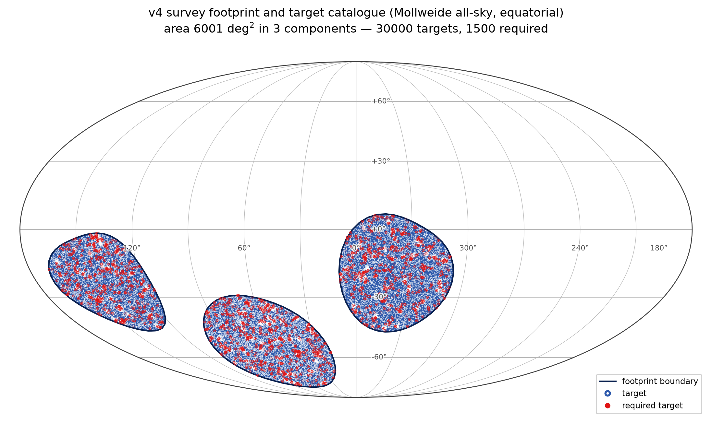
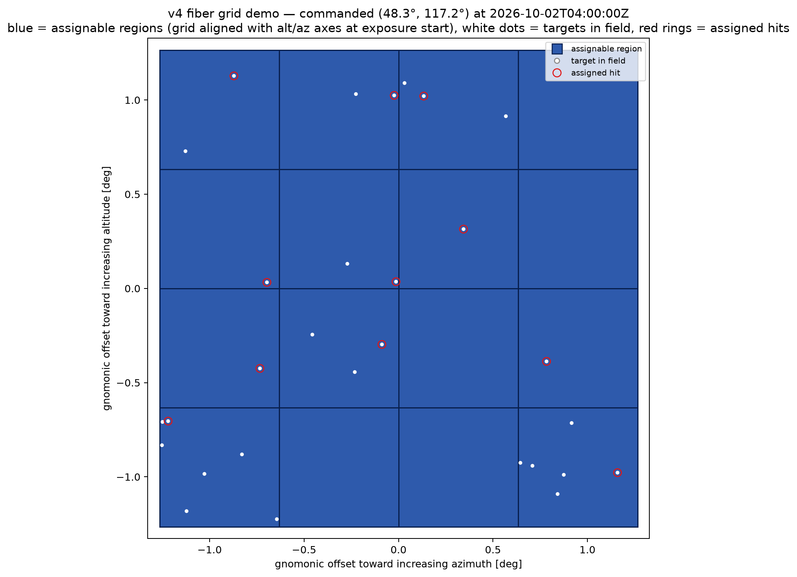

# GOSIM Agent Observer Challenge：v4 参赛者综合说明（草稿）

本比赛要求参赛者提交一个能够自主决定天文观测计划的智能体。智能体需要在给定的观测时间内，模拟操作一台光谱巡天望远镜，选择每次曝光的时刻、指向、时长、观测程序，以及光纤与目标的对应关系。智能体需要合理规划时间分配，以尽可能提高最终的综合得分。

本文将详细说明比赛版本的任务、公开评分规则，以及必要的数据结构和接口，供参赛者理解比赛的物理模型与设计策略；具体数值和交互协议仍须**以正式发布的任务卡为准**。文中的天区面积、目标数量、望远镜台址和观测周期是当前的**示例配置**，并不代表比赛实例。参赛者在比赛中无法获知观测过程中的天气真值、未来事件时刻或生成随机种子。

## 1. 天区与观测目标

比赛公开观测天区的边界与目标目录，具体视场由智能体根据目标分布自行安排。当前示例的天区由三个互不相连的区域组成，总面积约 $6000\,\mathrm{deg}^2$，包含约三万个目标，分为 ELG（发射线星系）、BGS（亮星系）、LRG（亮红星系）、QSO（类星体）和 Star（恒星）五类。每个区域都是一个球面多边形，相邻顶点之间按球面大圆弧连接。

天区的精确边界以公开的 `footprint.csv` 为准。文件中的每行描述一个顶点，表头含义如下：

- `component_id`：顶点所属的区域编号。
- `vertex_index`：顶点在该区域内的顺序编号。
- `ra_deg`、`dec_deg`：顶点的赤经和赤纬，单位均为度。

例如，记录 `C00,0,335.000000,5.248027` 表示 C00 区域的 0 号顶点，其赤经为 $335^\circ$、赤纬为 $5.248027^\circ$。同一区域的顶点按 `vertex_index` 顺序连接，最后一个顶点再连回第一个。



*图 1：示例天区由三个互不相连的区域组成，深蓝色表示天区范围，浅色点表示普通目标，红色圈点表示 `required` 目标。图像仅帮助理解空间分布；精确边界和目标坐标以公开数据文件为准。*

公开的 `targets.csv` 每行对应一个目标，表头含义如下：

- `target_id`：目标的唯一标识。
- `ra_deg`、`dec_deg`：目标的天球赤经和赤纬，单位均为度。
- `target_class`：目标类别，为 ELG、BGS、LRG、QSO 或 Star。
- `feature_flux`：用于计分的相对亮度参数，记为 $f_i$；数值越大，同等条件下越容易获得有效信号。
- `science_weight`：目标的科学权重，记为 $w_i$；它决定完成因子转化为得分时的权重。
- `required`：是否属于需要优先完成的目标。

目标类别仅用于描述目录组成，不会在上述公开属性之外另加得分倍率。当前目标目录不包含红移字段。

任一 `required` 目标若在观测周期结束时未达到第 7 节所述的完成门槛，就会产生额外罚分；当前示例中这类目标占总数的 5%。因此，智能体需要同时考虑目标的亮度、科学权重、是否为 `required`，以及它在天空中何时可见，从而做出综合决策。

当前观测目标的生成规则保证，每个目标在观测周期内至少有一晚存在一段不短于 900 秒的理论可观测窗口。这个保证只涉及太阳和目标高度的几何条件，不保证窗口内天气良好、光纤能够命中，或观测周期内有足够时间完成所有目标。目标的赤经、赤纬是**天球坐标**；观测台址使用地理纬度 $\phi$ 和经度 $\lambda$，两者的作用不同，下一节将说明如何由它们计算目标的天空位置。

本地任务卡中的 `targets.csv`、`footprint.csv` 与正式交互时 `initialize.payload.targets`、`initialize.payload.footprint` 承载的是同类公开数据。CSV 便于离线查看和调试；智能体在正式运行中应以本次 `initialize` 消息实际收到的内容为准。

## 2. 夜晚与目标在天空中的位置

目录中的赤经、赤纬描述目标在天球上的位置；望远镜实际指向则使用高度角（`alt`）和方位角（`az`）。`alt` 表示目标相对地平线的高度：地平线为 $0^\circ$，天顶为 $90^\circ$，地平线以下为负值。`az` 表示沿地平线从北向东转过的角度：北为 $0^\circ$、东为 $90^\circ$、南为 $180^\circ$、西为 $270^\circ$。智能体动作中的 `pointing.alt_deg` 和 `pointing.az_deg` 就是以度为单位的这两个指向角。在当前模型中，观测目标的赤经、赤纬固定，而从台址的地平坐标系中，所见目标的高度角 `alt`、方位角`az` 会随时刻变化。下文分别用 $h_i(t)$ 和 $A_i(t)$ 表示目标 $i$ 的 `alt` 和 `az`。

下面的公式说明如何从目标的赤经、赤纬算出指定时刻的 `alt`、`az`。计算先用 UTC 时刻和台址经度求地方恒星时，再得到目标的时角，最后结合台址纬度求高度角和方位角。本文示例台址为南纬 $24.6157^\circ$、西经 $70.3976^\circ$。设台址的地理纬度为 $\phi$、经度为 $\lambda$。$JD(t)$ 为 UTC 时刻的儒略日，若从 UTC 的 Unix 时间戳计算，可以取 $JD(t)=\operatorname{UnixSeconds}(t)/86400+2440587.5$；这里的 Unix 时间戳是从 1970 年 1 月 1 日 00:00 UTC 起经过的秒数。采用东经为正的 $\lambda$ 规范，令 $d=JD(t)-2451545.0$，则地方恒星时近似为

$$
\operatorname{LST}(t)=\left[280.46061837+360.98564736629d+\lambda\right]\bmod 360^\circ.\tag{1}
$$

示例台址位于西经 $70.3976^\circ$，按东经为正的约定取 $\lambda=-70.3976^\circ$。代入公式(1)后，公式具体写为

$$
\operatorname{LST}(t)=\left[280.46061837+360.98564736629d-70.3976\right]\bmod 360^\circ.
$$

公式中的 $t$ 直接使用消息给出的 UTC 时刻。`utc_offset_hours` 只用于理解台址的当地日期和时间，不应先用它把 UTC 转为当地时间后再计算儒略日，否则会重复引入时差。

> **注：什么是地方恒星时？** 可以把它理解为此刻经过当地南北方向子午线的赤经读数。文中用角度表示恒星时，$360^\circ$ 对应 24 小时。例如，若地方恒星时为 $100^\circ$，则赤经为 $100^\circ$ 的目标正经过子午线。它与日常钟表时间不同，主要用于确定目标此刻在天空中的位置。

对位于赤经 $\alpha_i$、赤纬 $\delta_i$ 的目标，时角 $H_i(t)=\operatorname{LST}(t)-\alpha_i$；把角度换成弧度参与三角函数后，其当前所处的高度角 $h_i$ 满足

$$
\sin h_i=\sin\phi\sin\delta_i+\cos\phi\cos\delta_i\cos H_i.\tag{2}
$$

对于不在天顶的目标，方位角 $A_i$ 可由下面两式联合确定，并将结果归一到 $[0^\circ,360^\circ)$：

$$
\begin{align}
\sin A_i&=\frac{-\sin H_i\cos\delta_i}{\cos h_i},\qquad\tag{3}\\
\cos A_i&=\frac{\sin\delta_i-\sin h_i\sin\phi}{\cos h_i\cos\phi}.\tag{4}
\end{align}
$$
公式(3)和(4)在天顶处没有唯一解，但在本次比赛中，仍需为天顶指向填写一个合法的 `az` 值（见第 8 节）。由公式(2)至(4)可求出目标的高度角 $h_i$ 和方位角 $A_i$，供智能体选择指令中的 `alt` 和 `az`。

本次比赛规定太阳高度角降至 $-18^\circ$ 后进入黑夜，升过 $-18^\circ$ 时为白天。太阳高度角的计算也使用公式(2)，只是太阳的赤经、赤纬会随时刻变化。当前比赛用近似算法计算以下中间角：

$$
\begin{aligned}
L&=(280.460+0.9856474d)\bmod 360^\circ, &
g&=(357.528+0.9856003d)\bmod 360^\circ,\\
\ell&=(L+1.915\sin g+0.020\sin 2g)\bmod 360^\circ, &
\epsilon&=23.439^\circ-0.0000004^\circ d.
\end{aligned}
$$

由此使用 `atan2(y, x)` 和反三角函数得到太阳的赤经 $\alpha_\odot$ 和赤纬 $\delta_\odot$：

$$
\begin{align}
\alpha_\odot&=\operatorname{atan2}(\cos\epsilon\sin\ell,\cos\ell)\bmod 360^\circ,\qquad\tag{5}\\
\delta_\odot&=\arcsin(\sin\epsilon\sin\ell).\tag{6}
\end{align}$$

> **注：`atan2(y, x)` 是什么？** 它是常见编程语言数学库提供的二参数反正切函数，会同时根据 $x$ 和 $y$ 的符号判断角度所在象限。与只计算 $\arctan(y/x)$ 相比，它不会丢失象限信息，并且能处理 $x=0$ 的情况。

最后把太阳的赤经、赤纬代入公式(2)，就得到指定 UTC 时刻在示例台址看到的太阳高度角：

$$
h_\odot(t)=\arcsin\!\left[\sin\phi\sin\delta_\odot+
\cos\phi\cos\delta_\odot\cos\bigl(\operatorname{LST}(t)-\alpha_\odot\bigr)\right].\tag{7}
$$

月亮的位置先在黄道坐标系中估算。仍令 $d=JD(t)-2451545.0$，定义月球平均黄经 $L_M$、月球平近点角 $M_M$ 和纬度参数 $F_M$：

$$
\begin{aligned}
L_M&=(218.316+13.176396d)\bmod 360^\circ,\\
M_M&=(134.963+13.064993d)\bmod 360^\circ,\\
F_M&=(93.272+13.229350d)\bmod 360^\circ.
\end{aligned}\tag{8}
$$

由此近似得到月球黄经 $\lambda_M$ 和黄纬 $\beta_M$：

$$
\lambda_M=L_M+6.289^\circ\sin M_M,\qquad
\beta_M=5.128^\circ\sin F_M.\tag{9}
$$

使用前文太阳位置计算中的黄赤交角 $\epsilon$，先计算月球在赤道坐标系中的单位方向分量

$$
\begin{aligned}
x_M&=\cos\lambda_M\cos\beta_M,\\
y_M&=\sin\lambda_M\cos\beta_M\cos\epsilon-\sin\beta_M\sin\epsilon,\\
z_M&=\sin\lambda_M\cos\beta_M\sin\epsilon+\sin\beta_M\cos\epsilon,
\end{aligned}\tag{10}
$$

再得到月球赤经 $\alpha_M$ 和赤纬 $\delta_M$：

$$
\alpha_M=\operatorname{atan2}(y_M,x_M)\bmod 360^\circ,\qquad
\delta_M=\arcsin z_M.\tag{11}
$$

把 $\alpha_M$、$\delta_M$ 代入公式(2)，即可得到月亮在示例台址的高度角 $h_M(t)$。对任意两点 $(\alpha_1,\delta_1)$ 和 $(\alpha_2,\delta_2)$，当前模型用球面角距

$$
\Theta=\arccos\!\left[\sin\delta_1\sin\delta_2+
\cos\delta_1\cos\delta_2\cos(\alpha_1-\alpha_2)\right].\tag{12}
$$

将太阳和月亮的赤经、赤纬代入公式(12)，得到太阳—月亮角距 $\psi(t)$，月面照亮比例取

$$
I_M(t)=\frac{1-\cos\psi(t)}{2}.\tag{13}
$$

将月亮与目标 $i$ 的赤经、赤纬代入公式(12)，得到月亮—目标角距 $\rho_i(t)$。记 `scoring.lunar_model` 中的最大月光惩罚、月亮高度指数和角距衰减尺度分别为 $P_M$、$\gamma_M$ 和 $\theta_M$；当前示例取 $P_M=0.75$、$\gamma_M=1$、$\theta_M=35^\circ$。月光对该目标的质量因子为

$$
L_i(t)=1-P_M I_M(t)
\sin\!\bigl(\max(0,h_M(t))\bigr)^{\gamma_M}
\exp\!\left(-\frac{\rho_i(t)}{\theta_M}\right).\tag{14}
$$

月亮位于地平线以下时 $L_i=1$；月面越亮、月亮越高且越靠近目标时，$L_i$ 越小，对观测质量的削弱越强。月光在评分时逐目标计算，不会预先作为全场扣减写入 `sky_quality`。以上角度均以度为单位表示。这套月球位置公式是比赛采用的低精度近似，而不是高精度天文历表；参赛者复现比赛计算时应以这里给出的定义为准。


*图 2：上方黑白条表示以太阳高度角 $-18^\circ$ 为界的昼夜，下方为与 UTC 整 15 分钟对齐的 900 秒 slot 网格。两端画叉的 slot 跨越昼夜边界，因此不计入观测；曝光最晚在末个保留 slot 的终点结束。图中时段数量仅作示意。*

为便利天气条件的建模，比赛使用与 UTC 整 15 分钟时刻（如UTC 08:00、21:15、15:30、03:45）对齐的固定 900 秒时段（slot）网格，每个slot更新一次天气参数。夜晚以太阳高度角降至和升至 $-18^\circ$ 的时刻为界。首个保留 slot 从不早于黄昏的第一个网格点开始，末个保留 slot 在不晚于黎明的最后一个网格点结束。图示中两个边界各落在一个 slot 内，因此这两个跨界 slot 均被舍弃；若边界恰好与网格点重合，该侧就没有跨界 slot。每晚的曝光在最后一个保留 slot 的终点停止。参赛选手需要据此规划曝光。

另一个与目标方位有关的量是大气质量（air mass），代表光线穿过的大气厚度。一般来说，目标越靠近地平线，光线穿过的大气越多。评分使用随高度角变化、且在天顶归一化的大气质量 $X(h)$。令天顶距 $z=90^\circ-h$，当前比赛规定

$$
X(h)=\frac{\left[\cos z+0.50572(96.07995-z)^{-1.6364}\right]^{-1}}
{\left[1+0.50572(96.07995)^{-1.6364}\right]^{-1}}.\tag{15}
$$

公式中 $z$ 的单位为度。目标越接近地平线，大气质量越大，对观测效果的负面影响越强，因而在观测中一般会设置一个目标高度下限。比赛将目标的最低观测高度角设为 $30^\circ$（见第 3 节）。

## 3. 曝光与fibermap：一次指向如何覆盖目标

智能体每发出一次 `observe` 指令视作进行一次曝光。曝光可以跨越同一夜的普通 slot 边界，但不能跨越两个夜晚。若当晚最后一个 slot 耗尽时，指令给出的曝光行动尚未完成，则曝光将在 slot 结束时刻终止，并按实际曝光时长计算观测质量与得分。智能体自主决定每次曝光的时长。出于模拟机制考虑，比赛要求单次曝光的申报时长为闭区间 $[60,3600]$ 内的整数秒，即 60 秒和 3600 秒都可以申报；因当晚 slot 耗尽而截断的实际时长可以短于 60 秒。由于大气质量的影响，比赛规定只有曝光时全程不低于 $30^\circ$ 的目标才进入计分。



*图 3：一次指向下的 $4\times4$ 光纤可指派区域。蓝色方格彼此相接，白点表示落在视场内的目标，红圈表示已正确指派并命中的目标。每个方格一次曝光最多对应一个目标；本图仅示意目标位置和分配结果。*

光谱巡天望远镜一般通过光纤接收来自目标的光线，再传递到光谱仪。智能体在每次曝光中须提交一个高度角、方位角指向，并把想观测的目标分配给具体光纤。当前示例将视场抽象为 $4\times4$ 个相邻的可指派方格，每格对应一根光纤，一次曝光最多分配一个目标。每格面积为 $0.4\,\mathrm{deg}^2$，边长 $a=\sqrt{0.4}\approx0.632^\circ$；方格之间没有间隙。视场边长为 $4a\approx2.530^\circ$，总面积为 $16\times0.4=6.4\,\mathrm{deg}^2$。

光纤编号由指向附近的局部切平面决定。把图上向上规定为**高度角增大**的方向，向右规定为**方位角增大**的方向；行号 $r$ 从下到上、列号 $c$ 从左到右增加，两者都从 0 到 3。编号为 $4r+c$，方格中心沿这两个方向的偏移分别为 $(r-1.5)a$ 和 $(c-1.5)a$。因此 0 号在左下，3 号在右下，12 号在左上，15 号在右上。这里的“上、下、左、右”是随望远镜指向定义的局部坐标方向，并非地图上固定的东、西、南、北，也不是赤经、赤纬的固定增减方向。视场方向在曝光起点由指向的方位角确定。即使同一方格内有多个目标，一次曝光也只能为该光纤指定其中一个。


*图 4：16 根光纤按 $4\times4$ 方格编号：行号 $r$ 自下而上、列号 $c$ 自左而右，均从 0 开始，编号为 $4r+c$。箭头表示指向处的局部高度角和方位角增大方向，不表示固定的地理方位。*

比赛后端在曝光开始时，以**实际指向**为中心把天空投影到局部切平面，并判断每个被指派目标落在何处。切平面采用球面心射投影：若 $\mathbf u_i$ 是目标方向单位向量，$\mathbf c$ 是视场中心方向，$\mathbf t_{\mathrm{az}}$ 和 $\mathbf t_{\mathrm{alt}}$ 分别是中心处朝方位角、高度角增大方向的单位向量，则平面坐标为

$$
x_i=\frac{\mathbf u_i\cdot\mathbf t_{\mathrm{az}}}{\mathbf u_i\cdot\mathbf c}\frac{180}{\pi},\qquad
y_i=\frac{\mathbf u_i\cdot\mathbf t_{\mathrm{alt}}}{\mathbf u_i\cdot\mathbf c}\frac{180}{\pi}.\tag{16}
$$

分母不为正的目标位于该切平面可见半球之外。实际指向可能与命令指向有偏差，此时后端以偏差后的中心计算投影。目标只有在**指派给自己的那条光纤的可指派方格内**才算命中；落在其他方格或视场外都不计分。相邻方格的公共边界只归其中一个方格，具体归属由后端的行列划分规则确定，因而请尽量避免观测恰好落到公共边界上的目标；视场外边界归最外侧方格。目标落在某个方格内却指派给另一条光纤，同样不会得分；没有被指派的目标即使位于视场内也不会计分。同一目标不能同时指派给多条光纤，因而一次曝光最多命中 16 个目标。当前模型假定命中后望远镜进行恒星跟踪，目标在曝光期间相对方格的位置不变，因此命中只在曝光起点判定；最低高度角仍须覆盖整个曝光。未命中不会额外扣分，但已经花去的时间不会返还。

## 4. 月亮、天气和事件消息

天文观测的曝光质量同时受到大气与仪器状态影响。`seeing`（视宁度）描述由大气造成的成像模糊程度，数值越小越好；`transparency`（大气透过率）越高越好；`sky_quality` 是比赛使用的天空条件质量因子，数值越高越好。`instrument_efficiency` 是整条采集链路的效率参数，越高越好。这些数值天气量及其未来真值不会直接发给智能体。主办方按观测时段发布粗粒度公告，并周期性提供描述性预报；两类消息中的事件条目给出事件类别和大致方向，预报另列预计受影响的观测夜。方向使用 N、NE、E、SE、S、SW、W、NW 或表示全场的 ALL。

智能体启动后收到的第一条协议消息是 `initialize`，无需回复。下面是一条示意消息。为便于看清层级，观测夜、天区和目标数组各只展示一项，`scoring` 也只展示部分字段；实际消息会包含完整的公开数据和评分配置。

```json
{
  "protocol_version": "participant-agent-protocol-v4",
  "message_type": "initialize",
  "payload": {
    "schema_version": "v4-initialize-v1",
    "task_card": {"card_id": "demo", "scenario_slug": "v4-demo", "phase": "local"},
    "site": {
      "name": "Paranal, Chile (virtual)",
      "latitude_deg": -24.6157,
      "longitude_deg": -70.3976,
      "utc_offset_hours": -4.0,
      "sun_altitude_limit_deg": -18.0,
      "minimum_altitude_deg": 30.0
    },
    "survey": {
      "start_utc": "2026-10-02T00:00:00Z",
      "end_utc": "2026-10-08T08:45:00Z",
      "slot_seconds": 900,
      "nights": [{
        "night_id": "N20261001",
        "night_date": "2026-10-01",
        "observing_start_utc": "2026-10-02T00:00:00Z",
        "observing_end_utc": "2026-10-02T09:00:00Z",
        "slot_count": 36
      }]
    },
    "instrument": {
      "n_fibers": 16,
      "grid_side": 4,
      "fiber_area_deg2": 0.4,
      "gap_deg": 0.0,
      "glass_side_deg": 0.632456,
      "pitch_deg": 0.632456,
      "fov_side_deg": 2.529822,
      "layout": "row-major, fiber 0 bottom-left; rows along +alt, columns along +az at exposure start; gnomonic plane centred on the actual pointing",
      "exposure": {"min_duration_seconds": 60, "max_duration_seconds": 3600}
    },
    "scoring": {"schema_version": "v4-score-v1", "q0": 0.68, "flux_zero_point": 0.5,
                "reporting": {"correct_reward": 100, "false_penalty": -150,
                              "false_report_free_allowance": 2, "max_consecutive_reports": 32}},
    "footprint": [{
      "component_id": "C00",
      "vertices": [[335.0, -5.2], [339.3, -6.3], [337.2, -3.8]]
    }],
    "targets": {
      "columns": ["target_id", "ra_deg", "dec_deg", "target_class", "feature_flux", "science_weight", "required"],
      "rows": [["V4T000001", 337.0, -5.0, "BGS", 1.48, 0.45, false]]
    },
    "limits": {
      "global_wallclock_seconds": 900,
      "max_consecutive_reports": 32,
      "response_max_bytes": 524288,
      "decision_timeout": "global only (no per-decision timeout)"
    }
  }
}
```

`initialize` 中各组字段的含义如下：

- `protocol_version`、`message_type` 和 `payload.schema_version`：分别标识比赛后端版本、初始化消息类型和初始化数据的结构版本。
- `task_card`：给出本次任务卡的标识和公开阶段信息。
- `site`：给出台址的名称、经纬度，以及太阳和目标的观测高度限制；这些参数用于计算太阳、月亮和目标在天空中的位置。
- `survey`：给出观测周期的起止时间、每个 slot 的时长和观测夜日历。`survey.nights` 中的 `night_date` 是该夜的标识日期，不一定等于首个 slot 的 UTC 日期；`slot_seconds` 在当前版本中为 900。
- `instrument`：给出第 3 节所述的视场、光纤和曝光参数。
- `scoring`：给出后文使用的完整公开计分配置。其中 `reporting.false_report_free_allowance` 是每次正确举报后可免罚的误报次数，示例值 2 表示在下一次正确举报前，前两次误报不扣分，从第三次开始每次扣 150 分；`reporting.max_consecutive_reports` 是连续提交 `report` 的次数上限，示例值为 32。
- `footprint`：以各天区的 `component_id` 和赤经、赤纬顶点 `vertices` 描述观测范围。
- `targets`：用 `columns` 声明目标表的列名，`rows` 中每行的值按相同顺序排列。
- `limits`：给出智能体运行和响应的限制。
    - `global_wallclock_seconds`：整张任务卡的实际运行时间上限，示例中为 900 秒。
    - `max_consecutive_reports`：连续提交 `report` 的次数上限，与 `scoring.reporting.max_consecutive_reports` 相同。达到上限后再次提交 `report` 会导致终止该任务卡。该次超限动作不再结算。提交 `wait` 或 `observe` 后计数归零；正确举报仍算一次 `report`。
    - `response_max_bytes`：每次智能体提交的整条 `decision_response` JSON 行的大小上限，包括协议字段和动作参数；按 UTF-8 编码后的字节数计算，不含末尾换行符。示例中的 524288 字节即 512 KiB。
    - `decision_timeout`：决策时限规则。当前只有上述全局运行时间限制，没有单次决策的独立时限。

初始化消息不包含未来天气真值，也不列出未来事件。

每次需要智能体决策时，系统发送 `decision_request`。首轮请求会紧跟在 `initialize` 消息之后。下面演示首轮请求：开场公告和首份预报既出现在 `new_messages` 中，也分别出现在 `latest_bulletin` 和 `latest_forecast` 中；此时尚无上一动作的结果。示例里的预报和事件只用于说明格式。

```json
{
  "protocol_version": "participant-agent-protocol-v4",
  "message_type": "decision_request",
  "decision_sequence": 1,
  "payload": {
    "schema_version": "v4-decision-snapshot-v1",
    "now_utc": "2026-10-02T00:00:00Z",
    "survey_end_utc": "2026-10-08T08:45:00Z",
    "observe_action_index": 0,
    "running_total": 0.0,
    "wallclock": {"elapsed_seconds": 0.047, "remaining_seconds": 899.953},
    "latest_bulletin": {
      "record_type": "bulletin",
      "slot_id": "N20261001-S001",
      "night_id": "N20261001",
      "issued_at_utc": "2026-10-02T00:00:00Z",
      "initial": true,
      "notices": [{"event_kind": "terrain_obstruction", "direction": "NE"}]
    },
    "latest_forecast": {
      "record_type": "forecast",
      "issued_at_utc": "2026-10-02T00:00:00Z",
      "coverage_start_utc": "2026-10-02T00:00:00Z",
      "coverage_end_utc": "2026-10-09T00:00:00Z",
      "notices": [{"event_kind": "overcast", "direction": "SW", "nights": ["2026-10-02"]}]
    },
    "active_requests": [],
    "new_messages": [
      {
        "record_type": "bulletin",
        "slot_id": "N20261001-S001",
        "night_id": "N20261001",
        "issued_at_utc": "2026-10-02T00:00:00Z",
        "initial": true,
        "notices": [{"event_kind": "terrain_obstruction", "direction": "NE"}]
      },
      {
        "record_type": "forecast",
        "issued_at_utc": "2026-10-02T00:00:00Z",
        "coverage_start_utc": "2026-10-02T00:00:00Z",
        "coverage_end_utc": "2026-10-09T00:00:00Z",
        "notices": [{"event_kind": "overcast", "direction": "SW", "nights": ["2026-10-02"]}]
      }
    ],
    "last_result": null
  }
}
```

各字段的含义如下：

- `protocol_version` 和 `message_type`：标识通信协议，以及声明这是一条决策请求。
- `decision_sequence`：本次决策的序号，智能体须在响应中原样带回。
- `payload.schema_version`：决策快照的结构版本，当前示例为 `v4-decision-snapshot-v1`。
- `now_utc` 和 `survey_end_utc`：当前模拟时间和观测周期结束时间，均使用 UTC。示例中进行了一周观测（10月1日至8日）。
- `observe_action_index`：截至当前已执行的观测动作数。
- `running_total`：截至当前各目标最佳得分之和；它不包含 `required` 罚分、均匀度罚分、限时观测请求奖励或 `report` 奖惩，因此不等于此刻停止时的最终总分。
- `wallclock`：智能体实际运行时间的已用量和剩余量。
- `latest_bulletin` 和 `latest_forecast`：截至当前时刻最新发布的一条公告以及天气和时间预报。
- `active_requests`：当前已经发布、尚未到期的限时观测请求及其实时进度；没有活动请求时为空数组。
- `new_messages`：自上次决策请求以来新送达的完整消息对象，包括公告、天气和事件预报、限时观测请求，以及适用时的请求结算、举报结果或状态更正。一次动作若跨过多个发布时间，这些消息会在下次请求中一起送达。
- `last_result`：上一动作的执行结果；首次决策时为空。

若上一动作是一次观测时，下轮请求中的 `last_result` 可以是：

```json
{
  "last_result": {
    "action": "observe",
    "observe_index": 0,
    "assigned_count": 3,
    "hit_count": 2,
    "hits": [
      {"target_id": "V4T000001", "score": 0.4321},
      {"target_id": "V4T000002", "score": 0.3125}
    ]
  }
}
```

`assigned_count` 是上次指派的目标数，`hit_count` 是其中通过光纤命中和最低高度检查的目标数；`hits` 只列出这些目标及其本次曝光得分，不返回光纤编号。命中目标仍可能因为天气或事件关闭而得到 0 分。已指派却没有出现在 `hits` 中的目标没有命中对应光纤，或没有满足整次曝光的最低高度要求。上例中假设第三个已指派目标没有通过这些条件。如果上一动作是 `wait`，`last_result` 为 `{"action": "wait"}`；若是 `report`，则会包含举报是否正确、故障是否修复及本次奖惩，详见第 4 节。

公告、天气和事件预报，以及举报结果和状态更正，均通过 `new_messages` 送达，而不是独立的外层协议消息。

天气和事件预报从观测周期的首夜开始，每隔 7 个日历日，在对应夜的观测开始时发布一次；这里的“每周”是以首夜为起点的七日节奏，并非固定在星期一。每次预报覆盖从发布时间起的 7 天。前文的首轮请求已经展示首份预报；下面用另一张持续两周的示意任务卡，展示一次周预报在 `decision_request` 中的位置。同一份新预报同时出现在 `latest_forecast` 和 `new_messages` 中。该夜首个 slot 的公告也在这条请求中。示例只保留一条预报 `notice`；实际 `notices` 可以为空，也可以包含多条。为避免重复，其他 `payload` 字段和两个 `latest_...` 对象以注释说明，下面的代码块是结构示意，不是可直接解析的完整 JSON 消息。

```jsonc
{
  "protocol_version": "participant-agent-protocol-v4",
  "message_type": "decision_request",
  "decision_sequence": 17,
  "payload": {
    // 省略 schema_version、now_utc、survey_end_utc、observe_action_index、
    // running_total、wallclock。
    // "latest_bulletin": 与 new_messages[0] 相同，
    // "latest_forecast": 与 new_messages[1] 相同，
    "new_messages": [
      {
        "record_type": "bulletin", "slot_id": "N20261008-S001", "night_id": "N20261008",
        "issued_at_utc": "2026-10-09T00:00:00Z", "initial": false,
        "notices": []
      },
      {
        "record_type": "forecast", "issued_at_utc": "2026-10-09T00:00:00Z",
        "coverage_start_utc": "2026-10-09T00:00:00Z",
        "coverage_end_utc": "2026-10-16T00:00:00Z",
        "notices": [{"event_kind": "overcast", "direction": "SW", "nights": ["2026-10-09"]}]
      }
    ],
    "last_result": {"action": "wait"}
  }
}
```

后续请求若没有新预报，`new_messages` 中便没有 `forecast` 对象，`latest_forecast` 则继续保存最近一次发布的预报。

当前 v4 的预报没有另设命中率、漏报率或误报率：进入预报的事件一定会在所列观测夜与观测窗口相交。预报的不确定性来自信息粒度——它只公开事件类别、粗略方向和受影响夜晚，不公开精确起止时刻、空间边界或强度。若未来任务卡引入概率预报，必须通过新的公开字段或协议版本另行说明。

预报对象及其 `notices` 中各字段的含义如下：

- `issued_at_utc`：这份预报的实际发布时间。
- `coverage_start_utc`、`coverage_end_utc`：这份预报覆盖的时间范围。
- `event_kind`：每条 `notice` 预期发生的事件类别。
- `direction`：事件的大致方向。`ALL` 表示全场；`N`、`NE`、`E`、`SE`、`S`、`SW`、`W`、`NW` 表示粗略方位，不说明扇区边界或受影响的高度角范围。
- `nights`：预计受影响观测夜的日期数组，日期对应 `survey.nights[].night_date`。它表示事件与这些夜晚的观测窗口有交集，不给出事件开始或结束的准确时刻。

同一晚的预报不能代替当晚逐 slot 的公告。

五类天气预报都使用上述同一种 `notice` 结构，只改变 `event_kind`、`direction` 和 `nights`。以下各项是**格式示例，并非某张任务卡的实际预报**：

```json
[
  {"event_kind": "rain", "direction": "ALL", "nights": ["2026-10-01"]},
  {"event_kind": "overcast", "direction": "SW", "nights": ["2026-10-02"]},
  {"event_kind": "haze", "direction": "NW", "nights": ["2026-10-03", "2026-10-04"]},
  {"event_kind": "cold_snap", "direction": "ALL", "nights": ["2026-10-05"]},
  {"event_kind": "storm", "direction": "ALL", "nights": ["2026-10-06"]}
]
```

`rain` 是降雨，`storm` 是强风暴；在受影响的天空范围内，它们可使观测暂时关闭。`overcast` 表示多云，`haze` 表示霾，可能使透过率或 `sky_quality` 降低、`seeing` 数值增大；两者可影响全场或某个方位扇区。`cold_snap` 表示寒潮，当前模型主要将其作为使得全场观测质量变差的事件。预报不提供 `seeing`、`transparency`、`sky_quality` 的数值，也不提供事件强度。天气事件的持续时长按**可观测 slot** 计数，遇到白天会在下一观测夜继续；预报中的 `nights` 仍只有夜粒度，不能用来推断持续多少个 slot。

每夜首条实时公告是该夜第一个 slot 的 `bulletin`，会发布与该slot相关的一些信息。之后每个 slot 也发布同结构的公告。下面两条分别示意观测周期的开场公告和后续某夜的首条公告：

```jsonl
{"record_type":"bulletin","slot_id":"N20261001-S001","night_id":"N20261001","issued_at_utc":"2026-10-02T00:00:00Z","initial":true,"notices":[{"event_kind":"terrain_obstruction","direction":"NE"}]}
{"record_type":"bulletin","slot_id":"N20261002-S001","night_id":"N20261002","issued_at_utc":"2026-10-03T00:00:00Z","initial":false,"notices":[{"event_kind":"overcast","direction":"ALL"}]}
```

公告中的字段和发布规则如下：

- `record_type`：固定为 `bulletin`，表明这是一条实时公告。
- `slot_id`：公告对应的 slot 标识。
- `night_id`：公告所属的观测夜标识。
- `issued_at_utc`：公告发布时间，即该 slot 的起点。
- `notices`：列出该 slot 相关的可公布事件；每条只含 `event_kind` 和 `direction`，没有预报里的 `nights`。空数组仅表示这个 slot 没有需要公布的事件，不能保证天气质量好或仪器正常。
- `initial`：只有整个观测周期的第一条slot公告中为 `true`，若望远镜附近地形存在一定遮挡，会在此公布遮挡的大致方向，其他slot不再公布。后续夜晚中全部为 `false`。

除已公告事件外，天气模型还可能产生不带 `notice` 的背景关闭。因此，即使 `notices` 为空，该 slot 仍可能完全无法观测；仪器故障也不会通过普通公告公开。智能体只能通过曝光反馈判断这些隐藏状态。

首夜开始时，首次 `decision_request` 的 `new_messages` 会同时包含开场公告与首份预报；相应的 `latest_bulletin`、`latest_forecast` 也会填入这两条记录。

除五类天气外，公开消息还可能包含火箭发射、地震和地形遮挡。它们沿用前述 `forecast` 或 `bulletin` 记录格式，通过 `decision_request.payload.new_messages` 送达。部分任务卡还会启用特殊压力场景，具体的状态更正消息和指向偏差见附录，具体以正式发布的任务卡为准。

下面三条记录分别示意火箭发射的提前预报、其发生时的实时公告，以及地震发生后的实时公告；它们发生在不同时间，并非同一次请求的 `new_messages`。

火箭发射的预报示例：

```json
{
  "record_type": "forecast",
  "issued_at_utc": "2026-10-02T00:00:00Z",
  "coverage_start_utc": "2026-10-02T00:00:00Z",
  "coverage_end_utc": "2026-10-09T00:00:00Z",
  "notices": [{"event_kind": "rocket_launch", "direction": "NE", "nights": ["2026-10-03"]}]
}
```

火箭发射期间的实时公告示例：

```json
{
  "record_type": "bulletin",
  "slot_id": "N20261003-S028",
  "night_id": "N20261003",
  "issued_at_utc": "2026-10-04T06:45:00Z",
  "initial": false,
  "notices": [{"event_kind": "rocket_launch", "direction": "NE"}]
}
```

地震发生后的实时公告示例：

```json
{
  "record_type": "bulletin",
  "slot_id": "N20261004-S010",
  "night_id": "N20261004",
  "issued_at_utc": "2026-10-05T02:15:00Z",
  "initial": false,
  "notices": [{"event_kind": "earthquake", "direction": "ALL"}]
}
```

各类事件的公布方式和影响如下：

- `rocket_launch`：表示预期或正在发生的火箭发射。后端实际生成一个带方位角边界和高度上限的隐藏地平坐标扇区，并在事件期间逐目标、逐时间片段判断是否关闭。公告中的 `NW` 等标签只由隐藏扇区的中心方位映射得到，不表示整个对应的 $45^\circ$ 方位区间；隐藏扇区也可能跨入相邻的粗略方向。预报只给受影响的观测夜和粗略方向，不透露精确起止时刻或空间边界；事件启动后，与其持续时间交叠的 slot 公告会包含同类条目。火箭事件最迟在启动夜最后一个 slot 的终点结束，未用完的预定时长不会延续到下一夜。
- `earthquake`：不进入预报，只在发生后通过公告出现。主要对仪器效率产生影响，影响会逐夜减弱，以模拟修复过程。后续受影响的观测夜仍可能出现地震公告，但不一定代表又发生了地震。
- `terrain_obstruction`：只在上文展示的开场公告中公布一次，表示整个观测周期内持续存在的低空遮挡，遮挡区域无法观测。

上述消息都不提供事件的精确空间边界、强度或数值乘子；智能体可结合公开消息、自行计算的天球位置，以及曝光后的命中与得分反馈判断实际条件。

部分任务卡会在运行过程中发布限时观测请求。请求只引用初始化时已经公开的 target，不会临时增加新的天体。未来请求在发布时间之前不会出现在初始化消息或决策快照中；到达 `issued_at_utc` 后，请求作为 `new_messages` 中的 `observation_request` 发布：

```json
{
  "schema_version": "v4-observation-request-v1",
  "record_type": "observation_request",
  "request_id": "V4RQ0001",
  "issued_at_utc": "2026-10-05T00:00:00Z",
  "deadline_utc": "2026-10-06T08:45:00Z",
  "target_ids": ["V4T000160", "V4T002330", "V4T000311", "V4T001021"],
  "minimum_completed": 3,
  "completion_factor_threshold": 0.5,
  "completion_reward": 100.0,
  "reason": "time-critical follow-up"
}
```

- `request_id`：请求标识，只用于追踪消息和结果；`observe` action 不需要、也不能填写该字段。
- `issued_at_utc`、`deadline_utc`：请求的起止时刻。只有完整落在 $[\mathrm{issued\_at},\mathrm{deadline}]$ 内的有效曝光才参与请求判定。
- `target_ids`：本次请求涉及的现有目标。
- `minimum_completed`：获得奖励至少需要完成的不同目标数。
- `completion_factor_threshold`：单个目标的完成因子门槛，按第 5 节的 $g_{i,e}$ 判定，不使用含 program 倍率的最终贡献。
- `completion_reward`：达到最低完成数后一次性获得的分数。
- `reason`：请求的简短公开说明。

后端自动把时间窗内的有效曝光归入所有适用请求；同一次曝光仍按普通规则获得科学分，也可同时推进重叠请求。每个目标只需有一次符合门槛的曝光，同一目标的多次不足曝光不会叠加。请求未完成不扣分。

请求有效期间，`active_requests` 会重复给出上述字段，并增加 `completed_target_ids`、`completed_count` 和 `remaining_count`。到达截止时刻后，请求从 `active_requests` 移除，并在 `new_messages` 中发送结果：

```json
{
  "schema_version": "v4-observation-request-result-v1",
  "record_type": "observation_request_result",
  "issued_at_utc": "2026-10-06T08:45:00Z",
  "request_id": "V4RQ0001",
  "status": "completed",
  "completed_target_ids": ["V4T000160", "V4T002330", "V4T000311"],
  "completed_count": 3,
  "minimum_completed": 3,
  "score_delta": 100.0,
  "revised": false
}
```

`status` 为 `completed` 或 `expired`。若 Hard mode 的 `data_loss` 后来撤销了请求时间窗中的曝光，后端会从有效账本重新计算进度；已经公布的结果发生变化时，会再发一条 `revised: true` 的结果，并相应撤销或恢复奖励。

仪器故障事件会使 `instrument_efficiency` 降低，但不会直接出现在公告或预报中。智能体可根据观测得分判断是否需要提交 `report`。若提交时确有尚未修复的仪器故障，后端立即修复该故障并在最终结算中奖励 100 分。提前、错误或重复举报都算误报：自上一次正确举报以来，前两次误报免罚，从第三次起每次扣 150 分；中间执行 `wait` 或 `observe` 不会重置这一计数。`report` 只修复仪器故障，不会消除地震造成的效率损失。

`report` 不推进模拟时间。若运行仍在继续，后端会在同一模拟时刻发出下一条 `decision_request`。以下是一次正确举报后，请求中相关字段的示意节选：

```json
{
  "now_utc": "2026-10-05T02:15:00Z",
  "latest_bulletin": {
    "record_type": "bulletin",
    "slot_id": "N20261004-S010",
    "night_id": "N20261004",
    "issued_at_utc": "2026-10-05T02:00:00Z",
    "initial": false,
    "notices": [{"event_kind": "earthquake", "direction": "ALL"}]
  },
  "new_messages": [{
    "record_type": "report_result",
    "issued_at_utc": "2026-10-05T02:15:00Z",
    "correct": true,
    "repaired": true,
    "score_delta": 100.0
  }],
  "last_result": {"action": "report", "correct": true, "repaired": true, "score_delta": 100.0}
}
```

这些字段的含义如下：

- `now_utc`：当前模拟时刻。举报不推进模拟时间，因此与提交 `report` 时相同；处理动作仍会消耗实际运行时间。
- `latest_bulletin`：最近一次按 slot 发布的公告。举报结果不会改写这条公告，也不会追加到下一条天气公告中；常规公告会在下一个 slot 起点继续发布。
- `new_messages`：本次新增一条举报结果通知。通知中的各个 key 为：
    - `record_type: "report_result"`：表明这是一条举报结果通知。
    - `issued_at_utc`：通知产生的模拟时刻，与本次 `report` 的提交时刻相同。
    - `correct`：本次举报是否正确。只有提交时存在尚未修复的仪器故障才为 `true`。
    - `repaired`：本次举报是否修复了仪器故障。正确举报会立即修复，值为 `true`；错误或重复举报为 `false`。
    - `score_delta`：本次举报的奖惩；正确举报为 100，免罚次数内的误报为 0，超过免罚次数的误报为 −150。
- `last_result`：上一动作的直接反馈。`action: "report"` 表示上一动作是举报；其中的 `correct`、`repaired` 和 `score_delta` 与 `new_messages` 中的通知一致。

`false_report_free_allowance` 决定每次正确举报后有多少次误报免罚，不限制举报动作本身。误报计数会跨越 `wait` 和 `observe` 保留，只有正确举报才会将其清零。`max_consecutive_reports` 则限制连续举报动作：示例中第 33 次连续 `report` 会导致整张任务卡终止运行，不另计奖惩；`wait` 或 `observe` 会重置这一动作计数，正确举报仍占用一次连续 `report` 次数。`running_total` 仍只统计目标最高分，不包含举报奖惩，举报奖惩在最终得分中结算。

## 5. 从曝光质量到目标得分

把一次曝光记作 $e$，实际时长记作 $T_e$；如果曝光在当晚的最后一个slot结束时被截断，$T_e$ 就是从开始到最后一个 slot 终点的秒数。评分端先在天气 slot 边界和事件起止时刻切分曝光，再把所得片段每隔 120 秒进行一次细分，不满 120 秒的部分也按照一次细分计算。记最终得到的时间片段集合为 $\mathcal P_e$，片段 $p$ 的时长和中点分别为 $\Delta t_p$ 和 $t_p$。再记 `scoring.q0` 为 $q_0$、`scoring.airmass_exponent` 为 $\beta$；当前示例取 $q_0=0.68$、$\beta=0.6$。目标 $i$ 的曝光质量为

$$
Q_{i,e}=
\frac{1}{q_0T_e}
\sum_{p\in\mathcal P_e}
\Delta t_p\,C_{i,p}\,
\frac{\eta_{i,p}\,\tau_{i,p}\,K_{i,p}\,L_i(t_p)}
{s_{i,p}\,X\!\left(h_i(t_p)\right)^{\beta}}.\tag{17}
$$

其中，$h_i(t_p)$ 是目标 $i$ 在片段中点的高度角，$X(h)$ 是式（15）定义的归一化大气质量。$C_{i,p}$ 是是否允许观测的指示量：如果片段中点存在有效的夜间天气数据、站点处于可观测状态，并且当时没有覆盖目标 $i$ 的关闭事件，则 $C_{i,p}=1$；否则 $C_{i,p}=0$。$\eta_{i,p}$、$\tau_{i,p}$、$K_{i,p}$ 和 $s_{i,p}$ 分别为片段中点处应用仪器故障状态及所有适用事件乘数后的仪器效率、透过率、`sky_quality` 和 seeing，$L_i(t_p)$ 为该目标在片段中点的月光因子。方向性事件是否适用，由目标在 $t_p$ 时刻的高度角和方位角决定。

各片段时长之和为整次实际曝光时长，即 $\sum_{p\in\mathcal P_e}\Delta t_p=T_e$。目标方位、大气质量、月光和方向性事件覆盖关系都以每个片段的中点所处位置为准。关闭片段通过 $C_{i,p}=0$ 保留在总时长分母中，因此不会因省略失效时间而使其余片段的平均质量虚高。

目标自身的 `feature_flux` 记为 $f_i$，`science_weight` 记为 $w_i$。令 `scoring.flux_zero_point` 为 $f_0$，`scoring.exposure_zero_point_seconds` 为 $T_0$；当前示例取 $f_0=0.5$、$T_0=900\,\mathrm{s}$。有效命中时，单次曝光的完成因子和科学贡献分别为

$$
g_{i,e}=\min\!\left(\frac{f_i T_e Q_{i,e}}{f_0T_0},1\right),
\qquad s_{i,e}=w_i g_{i,e}.\tag{18}
$$

后端先判定目标在整次曝光中是否满足最低高度角，并检查它是否正确命中所指派光纤的方格；只有通过这些条件的目标才进入逐目标质量计算。如果任一条件不满足，该目标整次曝光无效，而不是只扣除低高度的几分钟；同一视场中其他合格目标仍可得分。若天气或事件仅使部分时段关闭，则保留其他时段的质量贡献。这里的线性 $f_iT_e$ 与上限 1 是比赛用的简化信号模型：暗目标通常需要更长曝光，但达到上限后继续增加时间不会提高该次完成因子。$s_{i,e}$ 是基础科学贡献，且不会超过目标权重 $w_i$。申报的曝光时长须在上述闭区间内；若在夜末截断，则计算使用实际经过的时长。

## 6. DARK、BRIGHT 与 BACKUP

每次 `observe` 动作可声明一个观测程序：`DARK`、`BRIGHT` 或 `BACKUP`；当前原型在省略时按 `BACKUP` 处理，但智能体最好明确给出选择。它们分别鼓励把科学目标安排在较好、中等或较差的观测条件下；程序名称本身不会改变天气。评分端依据站点天气、**该目标方向**的月光和随时间变化的大气质量，为每个被命中的目标独立计算一个 program 质量 $B_{i,e}$。这一步不计入仪器效率和方向性事件乘子，因此 $B_{i,e}$ 与上节用于完成因子的 $Q_{i,e}$ 并不相同。评分端按天气 slot 边界切分曝光，再将所得片段细分至不超过 120 秒；记这些片段的集合为 $\mathcal W_e$，便有

$$
B_{i,e}=\frac{1}{q_0T_e}
\sum_{p\in\mathcal W_e}\Delta t_p D_p
\frac{\tau_p K_p L_i(t_p)}
{s_p X\!\left(h_i(t_p)\right)^{\beta}},\tag{19}
$$

其中 $D_p$ 是站点是否允许观测的指示量；站点关闭或没有夜间天气数据时取 0，其余情况取 1。与 $Q_{i,e}$ 相比，$B_{i,e}$ 有三项明确区别：

- 它不包含仪器效率 $\eta_{i,p}$，因此仪器故障不会改变 program 判档；
- 它使用该 slot 的站点天气 $\tau_p$、$K_p$ 和 $s_p$；全场天气影响已经包含在这些量中，但不再应用目标方向上的事件乘数；
- 它只使用站点级的 $D_p$，不应用火箭发射、地形遮挡等目标方向关闭项。

月光因子和大气质量仍按目标、按时间片段计算。因此同一次曝光中的不同目标可能得到不同的 $B_{i,e}$。

program 档位阈值来自 `scoring.program.bands`。当前示例中，当 $B_{i,e}\geq0.65$ 时，实际档位是 `DARK`；否则当 $B_{i,e}\geq0.40$ 时为 `BRIGHT`；其余为 `BACKUP`。匹配倍率来自 `scoring.program.multipliers`，当前示例中若声明与该目标实际档位相同，$m_{i,e}$ 分别为 1.20、1.12、1.06；不相同时采用 `mismatch_multiplier=1.00`。**一次曝光只有一个 `program` 声明，但视场内不同的目标适用的档位是不同的**，只有适用所选 `program` 的目标会得到倍率加成，其余为1。

$B_{i,e}$ 只用于判定目标的实际档位并确定 $m_{i,e}$，不会直接乘入得分。得到倍率后，该次曝光中目标 $i$ 的实际得分为

$$
c_{i,e}=s_{i,e}m_{i,e}.\tag{20}
$$

因此，program 加成以乘法方式作用于第 5 节定义的基础科学贡献。

## 7. 最终结算与时间取舍

同一目标可以重复曝光，但不累加多次曝光的信号；规则只保留每个目标所有**有效曝光**中最高的一次实际贡献：$\operatorname{best}_i=\max_e c_{i,e}$。`required` 的完成门槛来自 `scoring.required.observed_factor_threshold`，记为 $g_{\mathrm{req}}$；当前示例取 0.5。完成判定使用有效曝光中的最大原始完成因子 $\max_e g_{i,e}$，program 加成不能替代这一门槛。两个最大值可能来自不同的曝光。例如某目标的 $w_i=1.7$，第一次曝光有 $g=0.8$ 且命中 `DARK` 档，贡献为 $1.7\times0.8\times1.20=1.632$；第二次有 $g=0.9$ 但 program 不匹配，贡献仅 $1.7\times0.9=1.53$。该目标计入的最高贡献仍是 1.632，而完成状态采用 0.9。每个未完成 `required` 目标的罚分来自 `scoring.required.penalty_per_missing`，当前示例为 50。

为了鼓励天区覆盖而非只在局部反复观测，当前规则按 `scoring.uniformity.ra_band_width_deg` 将目录目标划分为赤经条带；当前示例宽度为 $10^\circ$。只对含目标的条带计算比例。令 $N_{\mathrm{band}}$ 为目录中实际含有目标的赤经条带数，$r_b$ 为条带 $b$ 中至少一次有效曝光的完成因子达到 `scoring.uniformity.observed_factor_threshold` 的目标数，除以该条带的目录目标总数；当前示例门槛为 0.5。这个比例对普通目标和 `required` 目标采用同一门槛，不乘科学权重或 program 倍率。以 Jain 指数衡量各条带的均匀性：

$$
J=\frac{\left(\sum_{b=1}^{N_{\mathrm{band}}}r_b\right)^2}
{N_{\mathrm{band}}\sum_{b=1}^{N_{\mathrm{band}}}r_b^2}.\tag{21}
$$
所有条带的 $r_b$ 都为零时，定义 $J=0$。为了更具象地理解均匀性指标，我们假设全天区只有两个各有目标的条带，若完成比例分别是 0.6 和 0.2，则可以计算出 $J=0.8$；按当前示例的 $U=200$，对应的均匀度罚分为 $200\times(1-0.8)=40$。

记每个未完成 `required` 目标的罚分为 $P_{\mathrm{req}}$，均匀度权重 `scoring.uniformity.weight` 为 $U$，所有已完成限时观测请求的奖励之和为 $R_{\mathrm{request}}$，所有 `report` 动作的奖惩之和为 $S_{\mathrm{report}}$。最终总分为
$$
S=\sum_i\operatorname{best}_i-P_{\mathrm{req}}N_{\mathrm{required\ missing}}
-U(1-J)+R_{\mathrm{request}}+S_{\mathrm{report}}.\tag{22}
$$
当前示例取 $P_{\mathrm{req}}=50$、$U=200$。每条请求的奖励以消息中的 `completion_reward` 为准，未完成请求的贡献为 0。仪器故障发生后，对当前尚未修复故障的首次正确举报奖励 100 分并立即修复该事件；自上次正确举报以来的误报超过免罚次数后，每次误报扣 150 分。`wait` 不产生单独罚分，时间成本体现在错过其他观测机会。最终策略需要在高权重目标、`required` 完成率、临时请求、天区均匀度与有限夜晚之间权衡。

## 8. 智能体看到什么、需要决定什么

当前原型在初始化时提供公开的台址、目标目录、天区边界、视场参数和评分规则。每个决策点提供当前 UTC 时间、观测周期结束时间、已发布的最新公告与预报、新消息、上次动作结果和当前累计目标分。曝光反馈列出实际命中的目标及其得分，但不返回命中目标使用的光纤编号，也不公开隐藏的逐 slot 天气数值。

正式交互采用 JSON Lines：后端写给智能体、智能体回复后端的每条消息都是独占一行的 JSON 对象。智能体收到 `initialize` 时不回复；每收到一条 `decision_request`，须在标准输出中回复恰好一条 `decision_response`，普通日志应写入标准错误。响应必须带回请求中的同一个整数 `decision_sequence`。动作字段与协议外层字段位于同一个 JSON 对象中；`reason` 和 `decision_source` 可以作为可选字符串供日志记录，不参与评分。

智能体可作出四类决策：`observe` 指定指向、光纤指派、曝光时长和 program；`wait` 推进模拟时钟但不生成观测数据；`report` 举报当前可能存在的仪器故障，不推进模拟时间；`finish` 主动结束运行。一次完整的 `observe` 响应如下，目标 ID 仅为占位示例：

```json
{
  "protocol_version": "participant-agent-protocol-v4",
  "message_type": "decision_response",
  "decision_sequence": 17,
  "action": "observe",
  "pointing": {
    "alt_deg": 55.0,
    "az_deg": 120.0
  },
  "assignments": {
    "0": "target_001",
    "5": "target_002"
  },
  "duration_seconds": 900,
  "program": "DARK",
  "reason": "示意性的决策说明"
}
```

`pointing.alt_deg` 必须位于闭区间 $[0^\circ,90^\circ]$，`pointing.az_deg` 必须位于 $[0^\circ,360^\circ)$。$30^\circ$ 的最低高度限制只约束被计分目标，不约束视场中心；指向中心低于 $30^\circ$ 仍是合法动作，但只有整次曝光均不低于限制的目标可能得分。`duration_seconds` 必须是公开曝光范围内的整数；当前示例为闭区间 $[60,3600]$。`program` 可取 `DARK`、`BRIGHT` 或 `BACKUP`，省略时按 `BACKUP` 处理。`assignments` 的键是光纤编号，值是已公开的目标 ID；同一光纤和同一目标在一次动作中都只能出现一次。

> **注：显式光纤指派。** `assignments` 字段必须出现在 `observe` 动作中。即使某个方格内只有一个目标，智能体也须明确写出该光纤编号与目标 ID 的对应关系；后端不会自动指派。`assignments` 可以是空对象 `{}`，但这样本次曝光不会记录任何目标，曝光时间仍会消耗。

> **注：天顶指向。** 若动作将 `alt_deg` 设为 $90^\circ$，仍须填写 `az_deg`，可取 $[0^\circ,360^\circ)$ 内任意值，例如 $0^\circ$。天顶的方位角在几何上没有唯一值，但当前模型用所填的 `az_deg` 确定视场网格方向；不同取值可能改变目标对应的光纤和命中结果，因此光纤指派须按所填值计算。

`report` 不需要动作附加字段，其完整响应为：

```json
{
  "protocol_version": "participant-agent-protocol-v4",
  "message_type": "decision_response",
  "decision_sequence": 18,
  "action": "report"
}
```

`wait` 可以通过整数秒数推进模拟时间；其申报范围与曝光时长相同：

```json
{
  "protocol_version": "participant-agent-protocol-v4",
  "message_type": "decision_response",
  "decision_sequence": 19,
  "action": "wait",
  "duration_seconds": 900
}
```

也可以指定一个晚于 `now_utc` 的 UTC 时间。时间字符串必须以 `Z` 结尾：

```json
{
  "protocol_version": "participant-agent-protocol-v4",
  "message_type": "decision_response",
  "decision_sequence": 20,
  "action": "wait",
  "until_utc": "2026-10-03T00:00:00Z"
}
```

两种 `wait` 写法只能选择一种，不能同时提交 `duration_seconds` 和 `until_utc`。长时间的 `until_utc` 等待在后端内部可跨过多个普通等待片段，但中途不要求智能体再次回复；期间发布的消息会在下一次请求中一并送达。

若智能体不再继续观测，可主动提交：

```json
{
  "protocol_version": "participant-agent-protocol-v4",
  "message_type": "decision_response",
  "decision_sequence": 21,
  "action": "finish"
}
```

动作只能包含其规定字段。无法解析的 JSON、超过 `response_max_bytes` 的响应、错误的协议版本或 `decision_sequence`、未知或多余字段、超范围或非有限数值、非整数秒数、未知目标、重复光纤或目标，以及超过连续举报上限后继续 `report`，都会以 `agent_error` 终止任务卡；超限或非法动作本身不结算，但此前已完成的有效观测和举报奖惩仍参与最终得分。光纤编号按整数解释，因此字符串键 `"5"` 和 `"05"` 会被视为同一根光纤。

全局实际运行时间从第一条 `decision_request` 开始计算，包含智能体思考和后端处理所消耗的时间，没有独立的单轮决策时限。时间耗尽时任务以 `global_wallclock_expired` 结束。正常结束后，后端会发送一条无需回复的最终 `finish` 消息，然后关闭输入：

```json
{
  "protocol_version": "participant-agent-protocol-v4",
  "message_type": "finish",
  "payload": {
    "schema_version": "v4-finish-v1",
    "termination_reason": "survey_complete",
    "decisions": 266,
    "observe_actions": 160,
    "last_decision_sequence": 21,
    "grace_seconds": 30
  }
}
```

`decisions` 是后端记录的动作行数；一次长距离 `until_utc` 等待可能在内部形成多行。`observe_actions` 是已执行的曝光动作数，`last_decision_sequence` 是最后处理的请求序号，`grace_seconds` 是收到结束消息后用于记录总结并退出的宽限时间。`termination_reason` 可能为 `survey_complete`、`agent_finished`、`global_wallclock_expired` 或 `agent_error`。若智能体在全局时限到达时仍未返回当前决策，进程可能被直接停止而收不到最终消息。最终得分在运行结束时已经确定。

在实际规划中，一个合理的决策循环可以分成三步：

1. 依据日期和天球位置筛出本夜可见的目标，再结合 `required`、科学权重和已有最高分挑选值得指向的区域。
2. 为视场中的目标分配光纤，依据公告、月相和先前反馈选择 program 与曝光时长，并提交动作。
3. 曝光结束后利用命中和得分反馈，更新对天气及目标完成状态的估计，然后进入下一次决策。

公告只有粗粒度信息，因此智能体可以利用短曝光探索当前的环境条件，但仍须为探索花费的时间负责。

## 附录 A：Hard mode 任务卡中的特殊事件

`data_loss`（观测数据丢失）和 `pointing_offset`（指向偏差）只会在启用 **Hard mode** 的任务卡中出现。普通任务卡不启用这两类事件。它们不属于第 4 节的天气公告或预报条目；参赛者应依据任务卡说明判断是否需要处理这些情况。

### 数据丢失与状态更正

`data_loss` 触发时，后端会让此前一段连续的 `observe` 动作失效，并重新计算各目标的有效最高分和完成状态。动作编号从 0 开始，只计算 `observe`，不把 `wait`、`report` 算入编号；被取消的曝光时间不会返还。智能体不会收到含 `event_kind: "data_loss"` 的公告，而是在下一次决策请求的 `payload.new_messages` 中收到一条 `state_resync` 记录。下面是该记录的格式示例，数值和目标 ID 均为示意：

```json
{
  "record_type": "state_resync",
  "issued_at_utc": "2026-10-09T00:00:00Z",
  "trigger_event_id": "V4ST0001",
  "invalidated_window": {
    "action_count_at_trigger": 20,
    "action_index_start": 4,
    "action_index_end_exclusive": 5,
    "window_start_fraction": 0.2,
    "window_end_fraction": 0.25,
    "window_max_fraction": 0.05
  },
  "observed_target_ids": ["V4T000001", "V4T000007"],
  "best_scores": [
    {"target_id": "V4T000001", "best_score": 0.4321},
    {"target_id": "V4T000007", "best_score": 0.86}
  ],
  "observation_requests": [{
    "request_id": "V4RQ0001",
    "target_ids": ["V4T000001", "V4T000007", "V4T000010"],
    "completed_target_ids": ["V4T000007"],
    "completed_count": 1,
    "minimum_completed": 2,
    "remaining_count": 1
  }]
}
```

- `issued_at_utc` 是这条状态更正送达时的模拟时间；`trigger_event_id` 标识本次数据丢失事件。
- `invalidated_window` 指出失效的观测动作区间。`action_count_at_trigger` 记为 $N$，`action_index_start` 含端点，`action_index_end_exclusive` 不含端点；对应的编号区间为 $[\lfloor iN\rfloor,\lfloor jN\rfloor)$，其中 $i$ 和 $j$ 分别由 `window_start_fraction` 和 `window_end_fraction` 给出。`window_max_fraction` 是该比例区间宽度的上限。
- `observed_target_ids` 和 `best_scores` 给出失效处理后仍有有效观测记录的目标及其当前最高分。智能体应据此更新自己的已观测目标和最好得分记录；同一决策请求中的 `running_total` 也已按更正后的结果重新计算。这里不返回每个目标的最大完成因子或 `required` 完成状态；需要精确维护这些状态的智能体，应结合 `invalidated_window` 与自己保存的有效曝光历史重新计算。
- `observation_requests` 给出数据失效后仍处于活动期的请求及其重算进度。它与同一决策快照中的 `active_requests` 一致；若已经到期的请求结算因此改变，`new_messages` 还会包含一条 `revised: true` 的 `observation_request_result`。

### 隐藏的指向偏差

`pointing_offset` 从观测周期开始对每次 `observe` 生效：后端在智能体提交的高度角和方位角上分别叠加一项固定偏差，再以偏差后的实际指向判定目标落在哪个光纤方格。它不会出现在 `new_messages`、公告或预报中，智能体也不会收到偏差的数值或实际指向。智能体只能从已指派目标反复未命中等反馈推测偏差，并在后续指向与光纤分配中自行调整。

## 附录 B：公开配置key索引

正式运行时，参赛者能够依赖的配置来自 `initialize.payload`。下面列出当前协议公开的全部配置组和参数key；具体数值以任务卡为准。

- `task_card`
    - `card_id`：任务卡标识。
    - `scenario_slug`：公开的场景标识；若任务卡提供该字段。
    - `phase`：任务卡所属阶段；若任务卡提供该字段。
- `site`
    - `name`：台址名称。
    - `latitude_deg`、`longitude_deg`：地理纬度和经度，东经为正。
    - `utc_offset_hours`：当地时间相对 UTC 的偏移，只用于时间解释，不替代天球计算中的 UTC。
    - `sun_altitude_limit_deg`：夜晚使用的太阳高度界限。
    - `minimum_altitude_deg`：目标在整次曝光中必须满足的最低高度角。
- `survey`
    - `start_utc`、`end_utc`：观测周期起止时刻。
    - `slot_seconds`：天气 slot 的秒数。
    - `nights[]`：公开观测夜日历；每项包含 `night_id`、`night_date`、`observing_start_utc`、`observing_end_utc` 和 `slot_count`。
- `instrument`
    - `n_fibers`、`grid_side`：光纤总数和方格单边数量。
    - `fiber_area_deg2`、`gap_deg`：单格可指派面积和相邻格间隙。
    - `glass_side_deg`、`pitch_deg`、`fov_side_deg`：单格边长、方格中心间距和视场边长。
    - `layout`：编号、局部坐标方向和投影方式的文字约定。
    - `exposure.min_duration_seconds`、`exposure.max_duration_seconds`：`observe` 和按秒 `wait` 的申报时长范围。
- `scoring`
    - `schema_version`：评分配置结构版本。
    - `q0`：公式（17）和（19）的质量归一化常数 $q_0$。
    - `flux_zero_point`、`exposure_zero_point_seconds`：公式（18）的 $f_0$ 和 $T_0$。
    - `airmass_exponent`：大气质量指数 $\beta$。
    - `lunar_model.angular_decay_scale_deg`、`lunar_model.altitude_exponent`、`lunar_model.maximum_penalty`：公式（14）的 $\theta_M$、$\gamma_M$ 和 $P_M$。
    - `program.bands.DARK`、`program.bands.BRIGHT`：program 判档阈值；低于二者时为 `BACKUP`。
    - `program.multipliers.DARK`、`program.multipliers.BRIGHT`、`program.multipliers.BACKUP`：声明与实际档位匹配时的倍率。
    - `program.mismatch_multiplier`：声明与实际档位不匹配时的倍率。
    - `required.penalty_per_missing`、`required.observed_factor_threshold`：每个未完成 `required` 目标的罚分及其完成因子门槛。
    - `uniformity.weight`、`uniformity.ra_band_width_deg`、`uniformity.observed_factor_threshold`：均匀度罚分权重、赤经条带宽度和计入条带完成比例的因子门槛。
    - `reporting.correct_reward`、`reporting.false_penalty`：正确举报奖励和达到扣分条件后的单次误报罚分。
    - `reporting.false_report_free_allowance`：每次正确举报后重新计算的免罚误报次数。
    - `reporting.max_consecutive_reports`：连续 `report` 动作上限。
    - `observation_requests.completion_factor_threshold`：限时观测请求中单个目标的公开完成因子门槛。
    - `observation_requests.miss_penalty`：未完成请求的罚分；当前 v4 固定为 0。
- `limits`
    - `global_wallclock_seconds`：整张任务卡的实际运行时间预算。
    - `max_consecutive_reports`：协议层重复给出的连续举报上限，与评分配置中的同名含义一致。
    - `response_max_bytes`：单条 `decision_response` 的 UTF-8 字节上限。
    - `decision_timeout`：决策时限模式；当前为只有全局时限。
- `footprint`：公开天区数组，每项包含 `component_id` 和按顺序排列的 `vertices`。
- `targets`：公开目标表，由 `columns` 声明列顺序，`rows` 保存数据。

天气生成种子、逐 slot 天气真值、事件精确起止时刻与空间边界、事件数值乘数，以及 Hard mode 的隐藏偏差不属于公开配置，不应写入参赛者文档或智能体输入。主办方若需要维护这些参数，应在独立的内部配置说明中记录。
